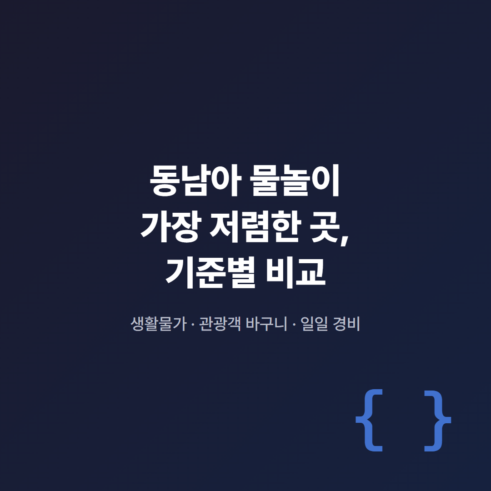
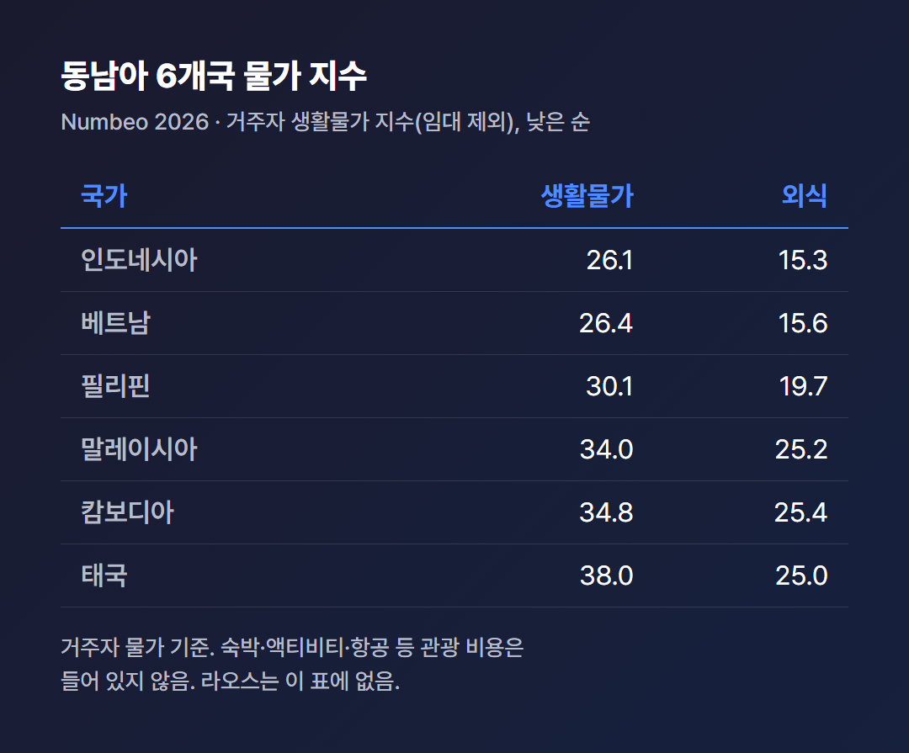
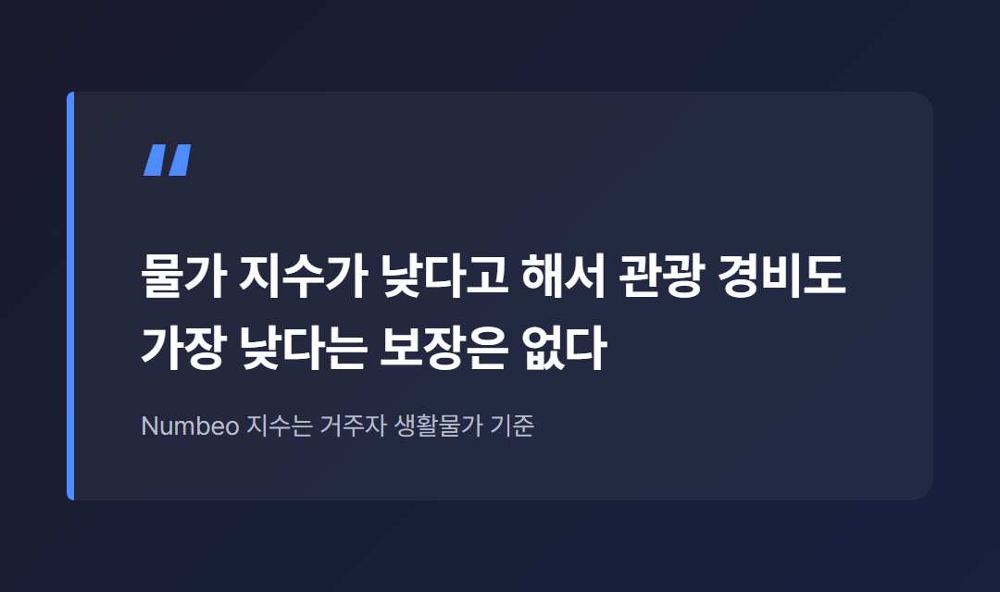
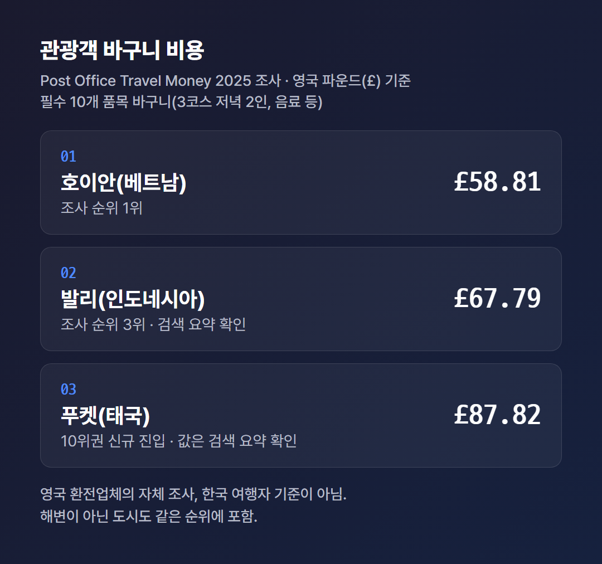
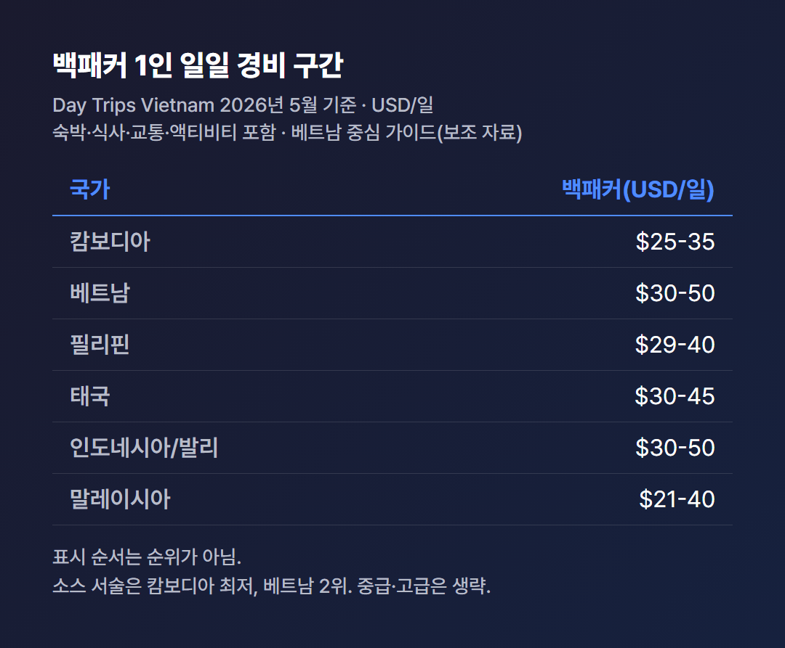
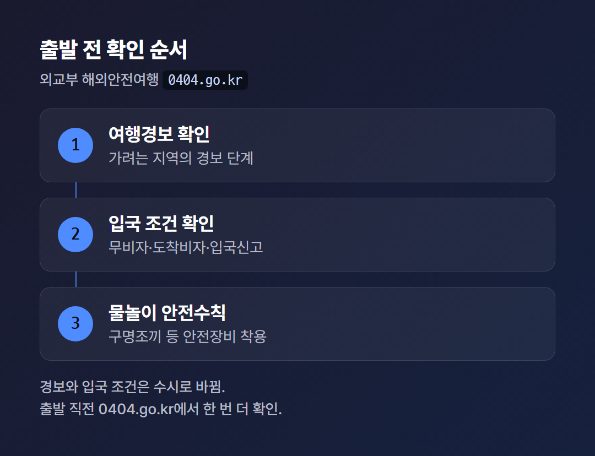
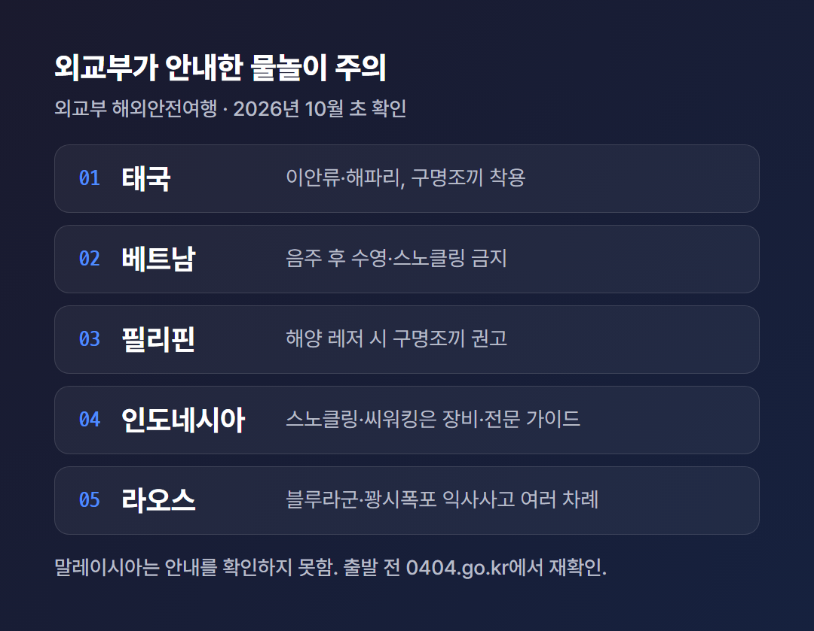

# 동남아 물놀이 가장 저렴한 곳, 기준별 비교

> 2026년 10월 초에 정리한 글이에요. 비용 자료는 2025년 10월 보도부터 2026년 5월 기준까지 섞여 있어서, 자료마다 시점을 함께 적었어요. 가격은 환율과 시즌에 따라 크게 움직이니 숫자는 참고용으로만 봐 주세요.

동남아 물놀이 여행지 중에 가장 저렴한 곳이 어디냐는 질문, 한 번쯤 검색창에 쳐 보셨죠?

저도 한 줄로 답하고 싶었어요. “여기가 제일 싸요” 하고요.

그런데 자료를 모아 보니 그 한 줄이 안 나오더라고요. (제목에 ‘가장 저렴한’을 달아 놓고 이러니 좀 민망하네요.)

그래서 이 글은 순위표가 아니에요. 비용을 재는 기준이 세 가지로 갈리고, 기준마다 앞서는 곳이 다르다는 걸 같이 살펴보는 글입니다. 입국 조건, 계절, 물놀이 안전처럼 가격만으로 정하기 어려운 부분도 함께 다뤄요.

확인하지 못한 부분은 못 했다고 그대로 적었어요.

위 그림이 이 글의 지도예요. 거주자 생활물가, 관광객 바구니, 1인 일일 경비. 이 세 가지 잣대를 차례로 볼 거예요.

---

## 가장 저렴한 곳, 하나만 꼽을 수 있나요?

꼽을 수 없어요. 동남아 물놀이 비용을 다룬 자료들이 서로 다른 것을 재고 있기 때문입니다.

하나는 현지 거주자의 생활물가 지수예요. 또 하나는 영국 환전업체가 관광객 필수 품목 10개를 담아 계산한 바구니 비용(영국 파운드 기준)이고, 마지막은 백패커·중급·고급으로 나눈 1인 하루 경비 구간(미국 달러 기준)입니다.

단위도 다르고 대상도 달라요. 국가 단위로 낸 자료가 있고, 도시 단위로 낸 자료가 있어요.

자료끼리 순위도 엇갈려요. 그래서 한쪽 손을 들어 주지 않고 양쪽을 다 적을게요.

---

## 물가 지수로 보면 어느 나라가 낮나요?

Numbeo의 2026년 동남아 국가별 생활물가 지수에서는 인도네시아(26.1)와 베트남(26.4)이 가장 낮아요. 필리핀 30.1, 말레이시아 34.0, 캄보디아 34.8, 태국 38.0 순으로 올라갑니다. 임대는 뺀 지수예요.

외식 지수만 따로 보면 인도네시아 15.3, 베트남 15.6, 필리핀 19.7이 낮은 쪽이에요. 라오스는 이 표에 없습니다.

이 지수는 거주자가 사는 데 드는 물가를 본 거예요. (이게 중요해요.) 숙박, 액티비티, 항공 같은 관광 비용은 들어 있지 않습니다.

Numbeo는 사용자가 제출한 데이터를 모은 생활물가 DB예요. 지수의 기준점이 페이지에 명시돼 있지 않아서, 기준이 무엇인지는 단정하지 않을게요.

물가가 낮은 나라가 곧 여행하기 싼 나라인 게 아니라, 거주자의 장바구니가 가벼운 나라일 뿐일 수 있어요. 그래서 동남아 물놀이 경비를 가늠할 때 이 숫자는 출발점으로만 쓰는 게 맞아 보여요.

---

## 동남아 물놀이 경비는 자료마다 순위가 다른가요?

달라져요. 관광객 바구니 비용에서는 베트남 호이안이 앞섰고, 1인 하루 경비 구간에서는 캄보디아와 말레이시아의 아래쪽 값이 낮게 나온 자료가 있어요.

먼저 바구니 비용이에요. 영국 Post Office Travel Money의 2025년 장거리 휴가지 조사를 업계 매체 트래블몰이 2025년 10월 2일에 보도했어요. 3코스 저녁 2인과 음료 등 관광객 필수 10개 품목을 담은 바구니 값을 비교한 조사입니다.

베트남 호이안이 £58.81로 1위, 2위는 케이프타운 £64.28, 5위는 도쿄 £68.61이었어요. 푸켓(태국)과 페낭(말레이시아)은 10위권에 새로 들어왔고요.

발리는 3위 £67.79, 푸켓은 £87.82예요. 이 두 값은 보고서 본문을 열어 보지 못하고 검색 요약으로만 확인했어요. 발리는 현지 가격이 올랐지만 루피아 약세가 상쇄했다고 보도됐습니다.

이 조사는 영국 환전업체의 자체 조사라서 파운드 기준이고, 한국 여행자 기준이 아니에요. 순위에는 케이프타운, 도쿄처럼 해변 여행지가 아닌 도시도 섞여 있어요. 필리핀 지역은 상위권에서 확인하지 못했습니다.

다음은 독립 가이드 사이트 Day Trips Vietnam이 2026년 5월 기준으로 낸 1인 1일 경비 구간이에요. 숙박·식사·교통·액티비티를 포함한 금액이고, 환율은 5월 중순 기준이라고 밝혀 뒀어요. 이 사이트는 중급과 고급 구간도 내놓는데, 여기서는 백패커 구간만 옮겼어요.

구간의 아래쪽 값만 보면 말레이시아 $21이 가장 낮고, 캄보디아 $25와 필리핀 $29가 뒤를 잇습니다. 그런데 이 자료의 서술은 캄보디아를 동남아에서 가장 저렴한 곳, 베트남을 두 번째로 적었어요. 표의 아래쪽 값과 글의 서술이 가리키는 방향이 조금 달라서 둘 다 적어 둡니다.

베트남을 중심으로 다루는 가이드 사이트라서 베트남에 유리하게 쓰였을 가능성도 있어요. 그래서 저는 보조 자료로만 봤어요.

동남아 물놀이 비용 자료를 정리하면 이래요. Numbeo에서는 캄보디아가 베트남보다 높고, Day Trips Vietnam은 캄보디아를 베트남 앞에 놓아요. Post Office는 호이안을 맨 앞에 세웠고, 발리가 3위, 푸켓은 그보다 높은 £87.82였어요.

누가 틀린 게 아니라 각자 다른 걸 잰 거예요.

동남아 물놀이 경비에는 환율도 변수예요. 트래블타임즈의 2026년 초 전망 기사는 달러·원 환율이 1,500원 수준까지 올랐고, 바트·동·페소 같은 동남아 통화도 함께 올랐다고 썼어요. 태국 바트는 최근 1년간 원화 대비 약 11% 올랐다고 하고요. (환율 얘기는 어디 가나 빠지질 않네요.)

같은 기사는 푸꾸옥을 신규 호텔 공급이 늘어난 ‘가성비 해변’으로 부상하는 목적지로 소개했어요. 다만 실제 숙박비 같은 가격은 확인하지 못했습니다.

[TODO: 직접 경험 넣기 - 실제로 다녀온 물놀이 여행지가 있다면 항공·숙박·식비·액티비티에 쓴 금액과 다녀온 계절]

---

## 동남아 물놀이 입국 조건과 계절은요?

한국 일반여권 기준으로 태국과 말레이시아는 90일, 베트남은 45일, 필리핀과 라오스는 30일 무비자예요. 인도네시아는 도착비자를 받고, 캄보디아는 비자가 필요합니다. 모두 외교부 기준이에요.

| 국가 | 조건 |
|---|---|
| 태국 | 90일 무비자. 2025년 5월 1일부터 입국 3일 전 온라인 도착카드(TDAC) 작성 |
| 베트남 | 45일 무비자(1회 입국). 관광 목적이면 귀국 항공권 필요 |
| 필리핀 | 30일 무비자(연장 가능) |
| 인도네시아 | 도착비자 30일(1회 30일 연장 가능), 비용 IDR 500,000. 전자 사전 신청 가능 |
| 말레이시아 | 90일 무비자(왕복권, 여권 유효기간 6개월 이상 필요). 디지털 입국카드(MDAC) 필수 |
| 라오스 | 30일 무비자(연장 불가) |
| 캄보디아 | 사증면제 목록에 일반여권 항목 없음. 공항 도착비자 가능, 전자입국신고(e-Arrival) 필수 |

푸꾸옥은 자료가 엇갈려요. 위키백과는 2014년 3월부터 30일 무비자라고 적었고, 외교부는 베트남 45일 무비자를 안내해요. 위키백과 서술이 오래된 내용으로 보여서 외교부를 따르되, 충돌이 있다는 점은 밝혀 둡니다.

입국 조건은 수시로 바뀌어요. 출발 전에 외교부 해외안전여행(0404.go.kr)에서 다시 확인해 보시면 좋겠어요. 캄보디아 비자 비용은 공식 자료로 확인하지 못했습니다.

동남아 물놀이 계절은 확인된 범위만 적을게요. 위키백과 자료는 보조로 봐 주세요.

- 필리핀: 우기는 6~10월이고 태풍 위험이 있어요(외교부).
- 푸꾸옥: 우기는 4~11월, 건기는 12~3월이에요. 건기에도 비가 조금 와요(위키백과).
- 인도네시아: 건기 4~9월, 우기 10~3월이고 지역 차이가 커요(위키백과).
- 태국: 안다만 해안은 연 강수량이 약 4,015mm로, 타이만 서안(600~850mm)보다 훨씬 많아요(위키백과).

나트랑, 보라카이, 세부, 발리 같은 곳의 구체적인 물놀이 적기는 믿을 만한 자료를 찾지 못했어요. 해변의 수질과 시야, 워터파크 입장료도 마찬가지예요. 항공권 가격, 비행시간, 직항 노선 목록도 확인하지 못했고요.

모르는 걸 아는 척하느니, 모른다고 적는 쪽이 낫겠다 싶었어요.

접근성에서 확인한 건 하나예요. 트래블타임즈는 2026년 초 기사에서 필리핀은 세부 노선이 줄었고 보홀 외 지역은 어렵다는 여행사 평가가 나왔다고 전했어요.

라오스는 바다가 없어요. 방비엥 블루라군, 루앙프라방 꽝시폭포 같은 민물 물놀이 장소가 외교부 안전 안내에 언급됩니다. 라오스는 앞의 두 비용 표에 없어서 비용 비교는 못 했어요.

경보와 입국 조건은 바뀌니까, 출발 직전에 이 확인을 한 번 더 하면 좋겠어요.

---

## 동남아 물놀이 안전은 어떻게 봐야 하나요?

외교부 안내에 물놀이·해양 사고 주의가 올라온 곳이 여러 나라예요. 공통된 권고는 구명조끼 같은 안전장비 착용입니다.

- 태국: 파도가 갑자기 높아질 수 있고 이안류가 익사 위험이 돼요. 안전요원이 없는 해변이 많아 구명조끼를 입으라고 안내해요. 해파리 쏘임이 있고, 구명장비 없이 스노클링하다 사망한 사례가 기록돼 있어요. 외진 해변은 피하라고 권고합니다.
- 베트남: 리조트·해변에서 물놀이 중 다치거나 익사하는 사고가 종종 나요. 음주 후 수영·스쿠버·스노클링은 하지 말라고 하고, 나트랑·푸꾸옥·무이네 같은 해안 관광지에서 안전수칙을 지키라고 해요.
- 필리핀: 스노클링·제트스키 등 해양 레저 중 안전사고가 자주 나서 구명조끼 착용이 권고돼요. 선박사고가 잦아 여객선 이용 주의 공지도 나와 있어요.
- 인도네시아: 스노클링·씨워킹은 안전장비와 전문 가이드가 필요해요.
- 라오스: 블루라군, 꽝시폭포 등에서 익사사고가 여러 차례 있었어요. 튜빙·카약·수영 때 안전장비 착용이 최선이고 의료 인프라가 약하다고 해요.
- 말레이시아: 물놀이 안전 안내는 확인하지 못했어요.

푸꾸옥에서는 2026년 7월 11일 관광객 36명이 탄 선박이 높은 파도와 바람 속에 전복돼 15명이 숨졌다는 보도가 있었어요. 한국인은 없었다고 해요. 당국은 운영사와 선박이 허가·안전기준을 충족했다고 밝혔고요.

저는 이 보도를 해상 이동이나 투어가 날씨의 영향을 받는다는 사례로 읽었어요. 사고 원인을 판단할 만한 자료는 없습니다.

여행경보도 짚어 둘게요. 이 글을 정리한 2026년 10월 초에 확인한 외교부 안내로는 베트남이 1단계(여행유의)예요. 필리핀의 보라카이, 보홀, 세부 막탄, 시아르가오는 1단계로 표시돼 있어요.

캄보디아는 2025년 12월 4일 조정 기준으로 시아누크빌이 3단계(철수권고)이고, 꼬콩을 포함한 7개 주가 특별여행주의보 지역이에요. 해변 지역이 포함돼 있어서 이 글에서는 물놀이 후보로 다루지 않았습니다.

태국의 푸켓·끄라비 단계는 확인하지 못했고, 인도네시아·라오스·말레이시아 일반 지역도 단계를 확정하지 못했어요. 경보는 수시로 바뀌니 출발 전 0404.go.kr에서 다시 확인해 보시면 좋겠어요.

건강 소식도 하나 있어요. 질병관리청은 2026년 7월 29일 휴가철 동남아(베트남·태국·필리핀·인도네시아·말레이시아)의 뎅기열, 치쿤구니야열, 지카바이러스 같은 모기 매개 감염병과 홍역에 주의를 당부했어요. 홍역 예방접종 여부를 확인하고, 곤충 기피제를 3~4시간마다 쓰고, 밝은색 긴팔·긴바지를 입으라고 권고했습니다.

물속 수질이나 해양 감염에 관한 공공기관 자료는 찾지 못했어요.

[TODO: 직접 경험 넣기 - 물놀이를 해 봤다면 안전요원·구명조끼 대여 여부 등 현장에서 직접 본 것]

---

## 그래서 어디로 갈까요?

정답 대신 질문을 하나 드릴게요. 이번 동남아 물놀이 여행지를 고를 때, 여러분은 무엇을 가장 아끼고 싶으세요? 항공권인가요, 숙박인가요, 하루 식비인가요?

아끼고 싶은 항목이 정해지면 어느 자료를 볼지도 정해져요. 생활물가는 인도네시아와 베트남이, 관광객 바구니는 호이안이, 하루 경비 구간은 캄보디아와 말레이시아가 눈에 띄었지만, 이건 기준이 다른 숫자였어요.

싸다는 말은

누가, 무엇을, 어떻게 쟀느냐에 따라

다른 얼굴을 하더라고요.

숫자는 바뀌어도 이 질문은 오래 쓸 수 있을 거예요. 다들 안전하게, 시원하게 놀고 오시면 좋겠어요. 진짜로요.

---

## 참고 자료

- [South-Eastern Asia: Cost of Living Index by Country 2026](https://www.numbeo.com/cost-of-living/rankings_by_country.jsp?title=2026&region=035) — Numbeo, 2026
- [Post Office Travel Money: Best value long haul destinations](https://www.travelmole.com/news/post-office-travel-money-best-value-long-haul-destinations/) — Travelmole, 2025-10-02
- [Long Haul Holiday Report 2025](https://www.postoffice.co.uk/travel-money/guides/long-haul-report) — Post Office Travel Money, 2025 (검색 요약으로만 확인)
- [Is Vietnam Cheap? 2026 Daily Costs vs 6 Asian Neighbours](https://daytripsvietnam.com/guides/vietnam-cost-vs-southeast-asia-2026/) — Day Trips Vietnam, 2026년 5월 기준
- [[전망 2026] 아웃바운드 동남아 시장](https://www.traveltimes.co.kr/news/articleView.html?idxno=414942) — 트래블타임즈, 2026년 초
- [태국 여행 안전정보](https://0404.go.kr/ntnSafetyInfo/260/detail) — 외교부 해외안전여행
- [베트남 안전정보](https://0404.go.kr/ntnSafetyInfo/86/detail) — 외교부 해외안전여행
- [영사협정-사증면제](https://0404.go.kr/bbs/contsPst/MST0000000000113/13/detail) — 외교부 해외안전여행
- [필리핀 수빅시, 보라카이섬, 보홀섬, 세부막탄섬(라푸라푸시)](https://0404.go.kr/ntnSafetyInfo/252/detail) — 외교부 해외안전여행
- [인도네시아 안전정보](https://0404.go.kr/ntnSafetyInfo/181/detail) — 외교부 해외안전여행
- [라오스 4단계 지정 지역을 제외한 지역](https://0404.go.kr/ntnSafetyInfo/36/detail) — 외교부 해외안전여행
- [캄보디아 여행경보단계 일부 조정](https://0404.go.kr/bbs/travelAlertAjmt/ATC0000000048186/detail) — 외교부 해외안전여행, 2025-12-04
- [캄보디아 안전공지](https://0404.go.kr/bbs/safetyNtc/ATC0000000048198/detail) — 외교부 해외안전여행, 2025-12
- [말레이시아 3단계 지정 지역을 제외한 지역](https://0404.go.kr/ntnSafetyInfo/56/detail) — 외교부 해외안전여행
- [캄보디아 전자입국신고(e-Arrival) 시행 안내](https://www.mofa.go.kr/kh-ko/brd/m_3101/view.do?seq=1347552) — 주캄보디아대사관, 2024
- [휴가철 해외여행객 몰리는 동남아…'뎅기열·홍역' 주의보](https://www.sedaily.com/article/20073194) — 서울경제, 2026-07-29
- [베트남 유명관광지 푸꾸옥서 관광객 등 36명 탑승한 선박 전복](https://www.fnnews.com/news/202607111842263705) — 파이낸셜뉴스, 2026-07-11
- [Phú Quốc](https://en.wikipedia.org/wiki/Phu_Quoc), [Climate of Thailand](https://en.wikipedia.org/wiki/Climate_of_Thailand), [Climate of Indonesia](https://en.wikipedia.org/wiki/Climate_of_Indonesia) — Wikipedia (보조, 발행일 미확인)

---

#동남아물놀이 #동남아여행 #저렴한여행지 #물놀이여행지 #동남아물가 #해외여행경비 #여행경보 #무비자여행

<!-- 발행 메모 (블로그에 올릴 때는 이 아래를 지운다)
제목: 동남아 물놀이 가장 저렴한 곳, 기준별 비교 (24자)
핵심 키워드: 동남아 물놀이 / 본문 글자 수(공백 제외, 소제목·표·목록 포함, 제목·기준일 인용·참고자료·태그·IMAGE/TODO 줄 제외): 4,286자 / 키워드 횟수: 본문 10회(제목 포함 11회), 변형어 '물놀이 여행지' 2회 / 밀도: 정확일치만 1.4%, 변형어 포함 1.68% (횟수x6자/본문 글자 수)
이미지 자리: 7개 (카드, 표, 인용 박스, 카드, 표, 다이어그램, 카드)
직접 채울 곳([TODO]): 비용 섹션 끝(실제 지출 내역·계절), 안전 섹션 끝(현장에서 본 안전요원·구명조끼 상황)
research.md에 없어서 뺀 내용: 비용 절약 요령, 해변·숙소·식당·업체 추천, 일정, 물놀이 환경(수질·시야·산호)·워터파크 입장료·항공권·비행시간·직항 목록, 나트랑·보라카이·세부·발리의 물놀이 적기, PAGASA 원문, 캄보디아 비자 비용, 나트랑 캄란 리조트 사고(유족 주장만 있어 제외), YTN 2016 해파리 기사(오래되고 요약으로만 확인), 한국인 방문자 통계, 야놀자리서치 전망
정보 충돌 처리: 소스끼리 순위가 다른 Numbeo(캄보디아가 베트남보다 높음) / Day Trips Vietnam(표 하한은 말레이시아 $21, 서술은 캄보디아 최저·베트남 2위) / Post Office(호이안 1위, 발리 3위, 푸켓 £87.82)를 판정 없이 병기. 푸꾸옥 무비자(위키백과 30일 vs 외교부 45일)는 충돌을 밝히고 외교부를 따름. 환산·임의 계산 없음.
발행 전 확인: 외교부 0404.go.kr에서 여행경보·입국 조건 재확인(라오스·말레이시아·인도네시아 단계는 research에서도 미확정). 발리·푸켓 바구니 값은 검색 요약 확인분. 비용 수치는 소스·시점 그대로.
-->
