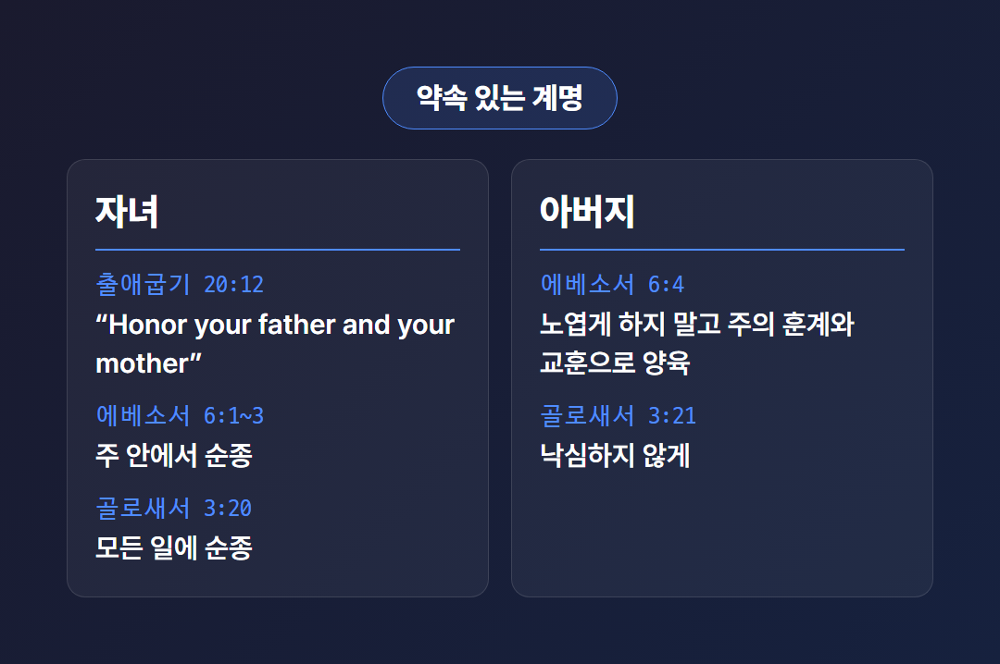
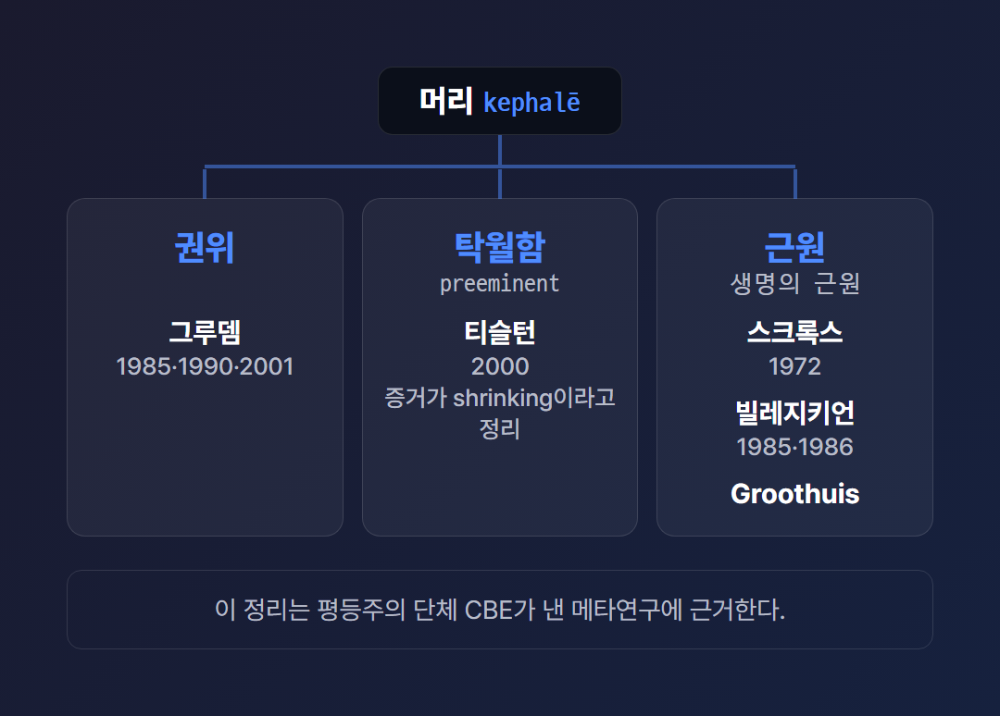

# 성경이 말하는 남편과 아내, 자녀의 도리

> 2026년 5월 기준으로 자료를 정리한 글이다. 성경 본문은 오래된 것이라 발행 연도가 따로 없다. 본문을 인용할 때는 개역개정과 ESV(영어 번역본)를 구분해 적었다.

성경이 남편과 아내, 자녀에게 말하는 도리는 무엇일까? 이 질문을 검색창에 넣는 분들의 속마음은 대개 두 갈래일 것이다. 하나는 정확히 무엇이 적혀 있는지 알고 싶다는 마음이다. 다른 하나는 “아내에게 복종하라는 구절을 지금도 그대로 따라야 하는가?” 하는 걱정이다.

나는 이 글에서 구절부터 차례로 읽으려 한다. 남편, 아내, 자녀, 부모에게 각각 무엇이 명령되어 있는지 확인하는 일이 먼저다. 그다음에 해석이 갈리는 대목을 양쪽 입장 그대로 옮긴다. 어느 쪽이 옳은지는 이 글이 판정하지 않는다. 나에게 그럴 자격이 없기 때문이다.

[TODO: 직접 경험 넣기 - 이 본문들을 처음 진지하게 읽게 된 계기나 가정에서 겪은 일, 있다면 2~3문장]

에베소서 5:21부터 6:4까지는 아내, 남편, 자녀, 아버지 순서로 이어진다. 그림의 네 칸이 그 순서다. 각 권면마다 이유가 붙어 있다는 점을 눈여겨볼 만하다.

---

## 가정의 도리는 성경 어디에 나올까?

핵심 본문은 세 곳이다. 에베소서 5:21~6:4, 골로새서 3:18~21, 베드로전서 3:1~7이다. 세 본문 모두 아내와 남편에게 각각 권면한다. 자녀와 아버지에게까지 말하는 곳은 에베소서와 골로새서다.

세 본문이 말하는 도리를 나란히 놓으면 대응 관계가 보인다.

표에서 베드로전서의 자녀·아버지 칸이 비어 있는 것은 그 구절이 없어서가 아니다. 이번에 확인한 3:1~7 범위에서 자녀 관련 구절을 찾지 못했기 때문이다.

이 권면들의 바탕에는 결혼에 대한 서술이 있다. 창세기 2:18~24는 사람이 혼자 있는 것이 좋지 않아 돕는 짝(ESV: helper fit for him)을 만든다고 적고, 둘이 한 몸이 된다고 말한다. 이 구절을 어떻게 해석하느냐는 이 글에서 다루지 않는다.

---

## 남편의 도리는 무엇일까?

남편의 도리로 공통되게 명령된 것은 사랑이다. 에베소서 5:25~27은 그리스도가 교회를 사랑하고 자신을 내어준 것 같이 아내를 사랑하라고 한다. 개역개정 5:28은 “자기 아내 사랑하기를 자기 자신과 같이 할지니”라고 적는다.

골로새서 3:19는 사랑하되 모질게 대하지 말라고 한다. ESV로는 “do not be harsh with them”이다. 베드로전서 3:7은 “지식을 따라” 아내와 함께 살라고 한다. 아내를 귀히 여기라는 말도 붙는다. 그 이유로 기도가 막히지 않게 하려는 것이 언급된다.

베드로전서 3:7은 아내를 “더 연약한 그릇”이라고 부르는 동시에 “생명의 은혜를 함께 이어받을 자”라고 적는다. 그 두 표현을 어떻게 함께 읽는지는 내가 확인한 자료에서 다루지 않았다.

남편의 도리인 이 사랑은 어떤 사랑일까? 한 개인 저자 주석(데이비드 구직)은 골로새서 3:19의 사랑을 희생적이고 자기를 부인하는 사랑으로 설명한다. 아내가 빌미를 주어도 쓰라림을 품지 말라는 뜻으로 읽는다. 옛 주석인 매튜 헨리는 그리스도의 사랑처럼 지속적이고 자기를 내어주는 사랑이라고 풀며 위로·보호·부양을 언급한다.

에베소서에서 남편에게 준 지면은 눈에 띈다. 아내에게 준 말보다 5:25~33의 남편 사랑에 대한 서술이 훨씬 길다. 그래서 “남편에게 명령된 것이 더 무겁지 않은가?”라는 질문이 나오기도 한다. 본문이 명령한 내용을 나란히 놓을 수는 있다. 무게를 저울에 다는 일은 읽는 이에게 남겨 둔다.

---

## 아내의 도리는 무엇일까?

아내의 도리로 명령된 것은 복종(또는 순종)과 존경이다. 개역개정 에베소서 5:22~24는 아내가 자기 남편에게 “주께 하듯” 복종하라고 한다. 이유로는 남편이 아내의 머리 됨이 그리스도가 교회의 머리 됨과 같다는 점을 든다. 5:33에서는 아내가 남편을 존경하라고 말한다(ESV: respect).

골로새서 3:18은 “주 안에서 합당하니라”로 끝난다. 구직은 이 말이 복종의 동기를 정하는 것이지 범위를 정하는 것은 아니라고 설명한다. 베드로전서 3:1~6은 아내에게 순종을 말하고, 외모의 단장보다 “마음에 숨은 사람”의 온유하고 안정한 심령이 하나님 앞에 값지다고 한다. 본보기로는 사라가 나온다.

같은 ‘복종’이라 해도 번역어는 조금씩 다르다.

개역개정은 에베소서와 골로새서에서 ‘복종’, 베드로전서에서 ‘순종’으로 옮긴다. ESV는 submit 또는 be subject to를 쓴다. 이 차이가 무엇을 뜻하는지는 뒤에서 다시 다룬다.

지혜문학에도 아내에 대한 말이 있다. 잠언 31:10~12는 현숙한 아내를 귀하다고 하고, 남편이 그를 신뢰한다고 적는다. 반대로 잠언 21:9와 19:13은 다투는 아내를 지붕 모퉁이나 끊임없이 떨어지는 물방울에 견준다.

---

## 자녀와 부모의 도리는 무엇일까?

자녀의 도리는 부모에 대한 순종과 공경이다. 아버지의 도리는 자녀를 노엽게 하지 않고 양육하는 일이다. 에베소서 6:1~3(ESV)은 자녀가 “in the Lord” 부모에게 순종하라고 하며, 십계명 5계명인 출애굽기 20:12를 인용한다. 그 계명에는 잘되고 땅에서 장수한다는 약속이 붙는다.

골로새서 3:20(ESV)은 모든 일에 부모에게 순종하라고 하고, 그것이 주를 기쁘시게 한다고 덧붙인다. 잠언 1:8은 아들에게 아버지의 훈계를 들으라고 한다. 구직은 이 순종이 저절로 생기지 않고 가르쳐야 한다고 설명한다. 성인이 된 자녀에게는 순종의 의무는 없어도 공경의 의무는 남는다고 본다. 이는 해석적 견해다.

자녀의 도리에 관해 한 가지는 솔직히 밝혀야 한다. 자녀의 순종이 어디까지 미치는가는 이번에 확인한 자료에 없었다. 죄를 요구하는 명령을 받으면 어떻게 하느냐는 물음에 내가 답할 근거를 갖지 못했다. “주 안에서”와 “모든 일에”라는 두 표현이 어떻게 함께 읽히는지도 마찬가지다.

아버지의 도리는 어떻게 적혀 있을까? 에베소서 6:4(ESV)는 자녀를 노엽게 하지 말고 “discipline and instruction of the Lord”로 기르라고 한다. 골로새서 3:21(ESV)은 자녀가 낙심하지 않도록 노엽게 하지 말라고 한다. 구직은 부권이 절대적이던 사회에서 “자녀의 감정이 고려되어야 한다”는 점이 새롭다고 본다. 자녀의 잘못된 행동이 부모 때문에 생길 수도 있다는 해설도 덧붙인다.

부모의 도리인 양육의 바탕은 신명기 6:4~7에서 볼 수 있다. 말씀을 자녀에게 부지런히 가르치고, 일상 속에서 이야기하라는 것이다. 잠언 22:6은 마땅히 행할 길을 아이에게 가르치라고 한다. 잠언 13:24는 매를 아끼는 자는 아들을 미워하는 자라고 말한다. 이 구절의 ‘징계’를 오늘 어떻게 적용할지는 이번 조사에서 확인하지 못했다. 아는 척하지 않는 편이 낫다.

[TODO: 직접 경험 넣기 - 자녀를 기르거나 부모를 대하며 이 본문을 마주했던 경험, 있다면 2~3문장]

---

## 복종이라는 도리는 왜 해석이 갈릴까?

쟁점은 크게 셋이다. 에베소서 5:21과 5:22의 관계, ‘머리’의 뜻, 그리고 복종·순종이라는 번역어와 그 한계다. 세 쟁점 모두 성경을 존중하는 사람들 사이에서 입장이 나뉜다. 여기서는 확인한 자료에 나온 주장을 그대로 옮긴다.

먼저 5:21 “그리스도를 경외함으로 피차 복종하라”와 5:22의 관계다. 긴 편지에서 한 문장만 오려 내 읽으면 뜻이 달라질 수 있다. 그렇다면 5:22는 5:21과 함께 읽어야 할까? 양쪽이 모두 그렇게 말한다. 다만 함께 읽은 결과가 다르다. 물론 이 비유는 관계 자체가 쟁점이라는 사실을 가려 주지 못한다.

표의 왼쪽 입장은 이렇다. 키너는 5:21과 6:9가 틀을 이루고, 그리스어 5:22에 동사가 없어 5:21의 동사가 이어진다고 본다. 그래서 아내의 복종은 상호복종의 한 예라는 것이다. 한국 목회자 기고(코람데오닷컴)도 남편과 아내가 그리스도를 중심으로 서로 복종하는 관계로 읽고, 일방적인 가부장적 순종은 아니라고 한다.

오른쪽 입장은 다르다. 기독일보가 소개한 보이스의 해설은 복종이 5:21 “피차 복종”에 근거해야 한다고 하면서도, 아내의 복종은 자발적 수용에 기초하며 결혼하는 이는 남편의 머리됨에 동의한 것이라고 정리한다. 단버스 선언은 남편의 리더십이 타락 이전 창조 질서의 일부라고 한다. 동시에 남편은 harsh or selfish leadership을 버려야 하고, 아내는 “willing, joyful submission”으로 자라야 한다고 말한다. 두 입장은 서로 다른 자료에서 나왔고, 나는 그 사이에서 결론을 내리지 않는다.

다음은 ‘머리’(그리스어 kephalē)의 뜻이다. 이 단어의 뜻이 권위인지 근원인지를 두고 학계 논쟁이 있다. 확인한 메타연구는 그루뎀을 ‘권위’ 뜻의 주요 옹호자로, 스크록스와 빌레지키언을 ‘근원’ 쪽으로 소개한다. 그루뎀 쪽은 권위라는 뜻이 이미 자리 잡은 의미라고 주장한다. Groothuis(Groothuis)도 ‘머리’가 권위가 아니라 기원 또는 생명의 근원을 가리킨다고 주장한다.

세 갈래를 한 장에 그렸다. 메타연구는 티슬턴의 정리를 소개하며 양쪽 증거가 약해졌고 ‘탁월함’이 절충 뜻일 수 있다고 정리한다. 이 메타연구는 평등주의 단체 CBE가 낸 글이다. 그 점을 감안하고 읽어야 한다. 한국어 자료인 매튜 헨리 해설은 남편을 머리 자리에 있는 이로 보되, 그 복종은 사랑과 존경에서 나온 것이며 강압이 아니라고 설명한다.

마지막은 번역어와 한계다. Groothuis은 아내에게 복종하라 했지 남편에게 ‘순종(obey)’하라고 하지는 않았다고 주장한다. 한편 개역개정 베드로전서 3장은 “순종하라”로 옮긴다. 번역어가 다르다는 사실만 기록해 둔다. 원어를 어떻게 읽어야 하는지는 나도 판정하지 않는다.

한계에 대해서는 양쪽이 비슷한 말을 한다. 단버스 선언은 어떤 복종도 죄를 따르라는 뜻은 아니라고 밝힌다. 코람데오 기고는 아내의 순종이 그리스도 경외로 이어질 때 성립한다고 본다. 한편 구직은 남편의 장점 여부와 관계없이 아내의 복종이 그리스도인의 삶의 일부라고 본다. 세 문장의 강조점은 같지 않다.

갈라디아서 3:28(ESV)은 “there is no male and female, for you are all one in Christ Jesus”라고 말한다. 이 구절과 가정 규범의 관계를 양쪽이 어떻게 해석하는지는 확인한 자료에서 직접 다뤄지지 않았다. 다만 단버스 선언은 남녀가 구원의 복을 동등하게 공유한다고 밝힌다.

부부가 서로의 도리를 함께 말하는 본문도 있다. 고린도전서 7:3~5(ESV)에서 남편은 아내에게 부부 관계의 의무를 다한다. 아내는 자기 몸에 대한 권한이 없고 남편이 있다고 말한 뒤, 같은 논리가 남편에게도 적용된다. 이 본문은 서로 자기 몸에 대한 권한이 있다는 말이다. 합의하여 기도에 전념하는 한시적 예외도 언급된다.

---

성경이 남편과 아내, 자녀에게 말하는 도리를 읽고 나면 남는 물음이 하나 있다. 그대는 이 구절들을 배우자에게 내밀 목록으로 읽고 있는가, 아니면 자기 몫으로 받을 명령으로 읽고 있는가?

이 글은 어느 입장이 맞다고 알려 준 게 아니라, 각 입장이 무엇을 근거로 삼는지 보여 준 것이다. 그 정도가 내가 할 수 있는 몫이었다.

내 정리에는 빠진 것이 있을 것이다. 본문은 일부만 요약 형태로 확인했고, 양쪽 원저작은 직접 읽지 못했다. 그러니 그대가 직접 본문을 펼치고, 양쪽 자료를 견주어 보기를 바란다. 남편과 아내, 자녀의 도리를 다시 묻는 자리가 그대의 가정에서 조금은 더 차분해지면 좋겠다.

---

## 참고 자료

- [Ephesians 5:21-33; 6:1-4 (ESV)](https://www.biblegateway.com/passage/?search=Ephesians+5%3A21-33%3B+Ephesians+6%3A1-4&version=ESV) — Bible Gateway
- [Colossians 3:18-21; 1 Peter 3:1-7 (ESV)](https://www.biblegateway.com/passage/?search=Colossians+3%3A18-21%3B+1+Peter+3%3A1-7&version=ESV) — Bible Gateway
- [Genesis 2:18-24; Exodus 20:12; Proverbs 22:6; 31:10-12; Deuteronomy 6:4-7 (ESV)](https://www.biblegateway.com/passage/?search=Genesis+2%3A18-24%3B+Exodus+20%3A12%3B+Proverbs+22%3A6%3B+Proverbs+31%3A10-12%3B+Deuteronomy+6%3A4-7&version=ESV) — Bible Gateway
- [1 Cor 7:3-5; Prov 1:8; 13:24; 19:13; 21:9; Gal 3:28 (ESV)](https://www.biblegateway.com/passage/?search=1+Corinthians+7%3A3-5%3B+Proverbs+1%3A8%3B+Proverbs+13%3A24%3B+Proverbs+19%3A13%3B+Proverbs+21%3A9%3B+Galatians+3%3A28&version=ESV) — Bible Gateway
- [베드로전서 3장 (개역개정)](https://www.bskorea.or.kr/bible/korbibReadpage.php?version=GAE&book=1pe&chap=3) — 대한성서공회
- [에베소서 5장 (개역개정)](https://www.bskorea.or.kr/bible/korbibReadpage.php?version=GAE&book=eph&chap=5) — 대한성서공회
- [The Case for Mutual Submission in Ephesians 5](https://www.cbeinternational.org/blogs/case-mutual-submission-ephesians-5) — Craig Keener / CBE International, 2016-06-01
- [The Danvers Statement](https://www.cbmw.org/about/danvers-statement/) — CBMW, 1988-11 최종 발표
- [A Meta-Study of the Debate over the Meaning of "Head" (Kephalē) in Paul's Writings](https://www.cbeinternational.org/resource/meta-study-debate-over-meaning-head-kephale-pauls-writings/) — CBE International (Priscilla Papers), 발행일 미확인
- [Biblical Submission within Marriage](https://www.cbeinternational.org/resource/biblical-submission-within-marriage/) — Rebecca Merrill Groothuis / CBE International, 2024-02-14
- ['아내들이여 남편에게 복종하라'… 어떻게 이해해야 하는가](https://www.christiandaily.co.kr/news/85971) — 기독일보, 이민선, 2020-01-23
- [메튜 헨리 주석, 에베소서 05장](https://hangl.net/com_kor_mhw/144957) — HANGL NOCR, 발행일 미확인(옛 주석)
- [Ephesians 6 Commentary](https://enduringword.com/bible-commentary/ephesians-6/) — David Guzik / Enduring Word
- [Colossians 3 Commentary](https://enduringword.com/bible-commentary/colossians-3/) — David Guzik / Enduring Word
- [남편과 아내는 피차 복종하는 관계](https://www.kscoramdeo.com/news/articleView.html?idxno=19852) — 코람데오닷컴, 김민호, 2021-05-26

---

#성경 #남편의도리 #아내의도리 #자녀의도리 #에베소서 #골로새서 #베드로전서 #피차복종 #성경속가정 #부부관계

<!-- 발행 메모 (블로그에 올릴 때는 이 아래를 지운다)
제목: 성경이 말하는 남편과 아내, 자녀의 도리 (22자)
핵심 키워드: 도리(남편과 아내, 자녀의 도리) / 본문 글자 수(공백 제외): 4,147자 / 키워드 횟수: "도리" 18회 (글자 기준 밀도 약 0.9%, 1,500자당 약 6.5회) / "성경" 4회
이미지 자리: 7개
직접 채울 곳([TODO]): 도입부(글을 쓰게 된 계기·가정 경험), 자녀·부모 섹션 끝(양육/부모 대하는 경험)
research.md에 없어서 뺀 내용: 자녀 순종의 한계, 잠언 13:24 징계의 적용 해석, 갈라디아서 3:28과 가정 규범의 관계 해석, 골로새서·잠언·십계명 한글 본문(ESV·개역개정 확인된 것만 인용), 베드로전서의 자녀 관련 구절, 보완주의 원문(그루뎀·파이퍼 등)
research.md의 정보 충돌을 어떻게 다뤘는지: 5:21과 5:22 관계, 머리(kephalē)의 뜻, 복종/순종 번역어를 양쪽 입장과 근거를 나란히 전하고 판정하지 않음. 메타연구가 평등주의 단체 발행임을 명시
발행 전 확인: 이미지 설명의 Groothuis 표기, 개역개정 골로새서 3:18 문구, 성경 본문 인용을 실제 번역본과 대조
-->

<!-- 조립 점검 (assembler)
점검일: 2026-09-30
이미지: 총 7개 / 파일 확인 7개 / 없는 파일 0개
남은 [IMAGE:] 마커: 0개
[TODO]: 2개
본문 글자 수(공백 제외): 4353자 (도입~맺음말, 이미지 문법·참고 자료·태그 제외) / 제목~태그 전체 6500자 / 이미지 alt 포함 7901자
알트 텍스트 누락: 0개
-->
