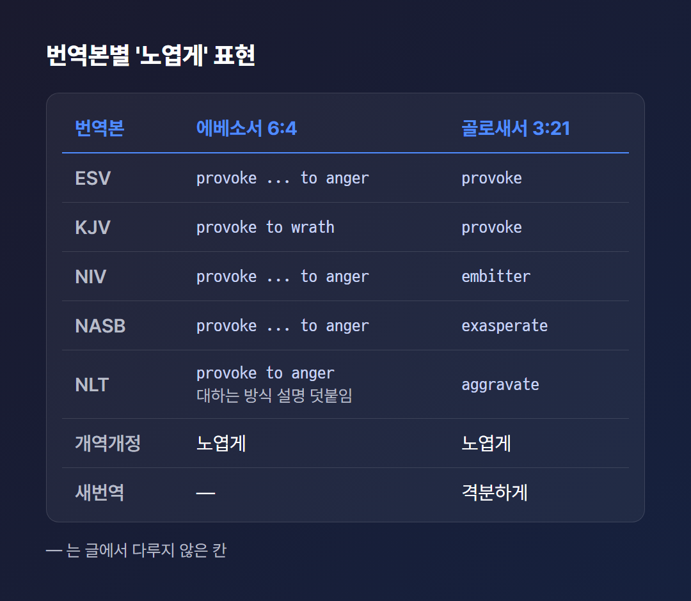

# 자녀를 노엽게 하지 말라는 말의 뜻

> 2026년 5월 기준으로 확인한 자료로 쓴 글이다. 성경 본문과 고전 주석은 오래된 자료이며, 주석은 Bible Hub와 Precept Austin 같은 모음 사이트를 통해 읽었다.

자녀를 노엽게 하지 말라. 에베소서와 골로새서에 나오는 이 한 줄을 읽고 나면 질문이 줄줄이 따라온다. 노엽게 한다는 것은 정확히 어떤 일일까? 아이가 화낼 일은 아예 하지 말라는 뜻일까? 그러면 야단은 어떻게 치란 말인가.

나는 신학자가 아니라서 이 질문에 판결을 내릴 수 없다. 대신 번역본, 원어 사전, 고전 주석이 이 구절을 어떻게 설명하는지 나란히 놓아 보려 한다. 주석이 갈리는 곳에서는 갈린다고 쓰고, 어느 쪽이 옳은지는 가리지 않는다. 한국어 주석은 이번에 찾지 못했다는 점도 미리 밝혀 둔다.

위 그림은 이 글이 다루는 두 구절이다. 같은 명령이 한 번은 긍정 명령과 함께, 한 번은 낙심이라는 이유와 함께 나온다. 이 둘을 차례로 풀어 보겠다.

---

## 두 본문은 어디에 놓여 있나?

두 본문 모두 자녀에게 순종을 말한 바로 뒤에, 아버지들에게 노엽게 하지 말라고 건네는 말이다. 순종을 요구받는 쪽이 아니라 권위를 가진 쪽을 향한 명령이라는 점이 먼저 눈에 들어온다.

에베소서 6:1–3은 자녀에게 순종과 공경을 말하고 십계명의 제5계명을 인용한다. 그 직후 6:4에서 말의 방향이 아버지로 바뀐다. 개역개정은 “또 아비들아 너희 자녀를 노엽게 하지 말고 오직 주의 교훈과 훈계로 양육하라”고 옮긴다. 개역한글은 '교훈' 자리에 '교양'이라고 쓴다.

그림처럼 골로새서 3:21도 3:20에서 자녀에게 순종을 말한 직후에 온다. 개역개정은 “아비들아 너희 자녀를 노엽게 하지 말지니 낙심할까 함이라”이다. 이 구절이 속한 3:18–4:1이 가정 규범이라는 설명은 일부 주석 요약에서만 확인했다. 에베소서 6장에 대해서는 Expositor's Bible이 제5계명을 로마의 효 개념과 견주며, 자녀의 순종이 가정 질서의 기초로 다뤄졌다고 설명한다.

번역본 표현은 서로 다르다. 에베소서 6:4의 '노엽게'를 ESV·NIV·NASB는 provoke ... to anger로, KJV는 provoke to wrath로 옮겼다. NLT는 아이를 대하는 방식으로 화나게 한다는 설명을 덧붙인다. 골로새서 3:21은 NIV가 embitter, ESV와 KJV가 provoke, NASB가 exasperate, NLT가 aggravate다.

한국어는 개역개정이 두 구절 모두 '노엽게'를 쓴다. 새번역 골로새서는 “격분하게 하지 마십시오”라고 쓰고, 낙심 부분은 “그들의 의기를 꺾지 않아야 합니다”로 풀어 쓴다. 어느 번역이 맞는지는 판정하지 않고 표현 차이만 적는다. ESV 골로새서 3:21의 정확한 본문은 ESV 사이트로 확인하지 못했다. Bible Hub 제목에서 so that they will not lose heart라는 표기를 본 것이 전부다.

표에서 보듯 '노엽게'라는 한국어 하나가 영어에서는 여러 단어로 흩어진다. 같은 뜻인데 번역이 달라졌는지, 원문 자체의 결이 달라서인지는 다음 장에서 원어를 보며 살펴본다.

---

## '노엽게 하다'는 원어로 무슨 뜻인가?

에베소서와 골로새서는 한국어로는 같은 '노엽게'지만 서로 다른 헬라어 동사를 쓴다. 에베소서의 parorgizo는 '곁에서 화나게 하다, 격노하게 하다'라는 뜻이다. 골로새서의 erethizo는 '자극해 반응하게 하다'이며, 나쁜 뜻으로는 '짜증나게·분하게 하다'로 쓰인다.

parorgizo부터 보자. 에베소서의 문장은 금지가 현재 시제로 쓰여서 '계속하는 것을 멈추라' 또는 '시작하지 말라'로 읽을 수 있다고 Precept Austin은 정리한다. 이 정리에 따르면 노엽게 하는 일의 문제는 순간의 폭발이 아니라 반복이다. 속에 맺힌 원망은 한 번에 생기는 게 아니라 되풀이되는 자극 속에서 쌓이는 것이다.

erethizo는 풀이가 갈린다. Precept Austin이 인용한 BDAG 정의는 앞서 말한 '자극해 반응하게 하다'이고, 이 단어는 신약에서 골로새서 3:21과 고린도후서 9:2 두 곳에만 나온다. 고린도후서에서는 긍정적 뜻으로 쓰인다.

Ellicott는 이 동사를 노여움이 아니라 '경쟁심을 일으키다'로 풀고, 끊임없고 쉼 없는 자극을 금한 것으로 읽는다. JFB는 '짜증나게 하지 말라'로, Cambridge Bible은 chafe, irritate로 옮긴다. Vincent는 이 단어가 고린도후서 9:2와 이 구절에만 나온다는 점에 주목한다.

카드의 둘째 칸에서 볼 수 있듯 이 두 읽기는 서로 다른 방향을 가리킨다. 한쪽은 밀어붙이는 자극을 말하고 다른 쪽은 마찰과 짜증을 말한다. 소스는 Ellicott의 설명이 고린도후서 9:2의 긍정적 용례와 어떻게 이어지는지 직접 풀어 주지 않았고, 두 읽기를 판정하지도 않는다. 이 글도 같은 자리에 선다.

---

## 노엽게 하면 자녀는 어떻게 되나?

골로새서는 노엽게 한 결과를 직접 적는다. 낙심이다. athymeo는 a(없음)와 thumos(기운·열정)가 합쳐진 말로, 의욕을 잃을 만큼 기가 꺾인 상태를 뜻한다고 Precept Austin은 정리한다.

바람이 빠진 풍선을 떠올리면 이해가 쉽다. 모양은 그대로인데 힘이 없다. 다만 풍선은 다시 불면 되지만, 사람의 낙심이 그렇게 간단하다는 말은 아니다. 비유는 여기까지만 쓴다.

주석가들은 이 낙심을 구체적으로 풀어 쓴다. Bengel은 낙심이 '청소년의 해악'이라고 했다. Barnes는 끊임없이 흠을 잡으면 자녀가 용기를 잃고, 부모를 기쁘게 할 수 없다고 여겨 절망한다고 쓴다. Gill은 자녀가 맥이 빠지고 무기력해지거나 부모의 사랑을 얻지 못한다고 생각해 지시와 훈계를 무시하고 완고하고 반항적이 될 수 있다고 설명한다.

Eadie(Precept Austin 인용)는 짜증이 끊이지 않으면 자녀가 기쁘게 하려는 노력을 포기하고 기계적인 순종만 하게 될 수 있다고 했다. 자라는 어린 영혼에게는 부드럽고 조심스러운 대우가 필요하다고도 했다. Spurgeon은 자녀는 순종해야 하지만 아버지는 화나게 해서는 안 된다는 취지로 말한다. Peter Pett은 지나치게 많은 명령과 비판이 낙심, 반항, 마지못한 눈가림 순종으로 이어지고, 지침이 너무 적으면 의심과 불확실이 생긴다고 쓴다.

[TODO: 직접 경험 넣기 - 부모의 말이나 태도 때문에 기가 꺾였던 기억, 또는 자녀의 기운이 빠져 보였던 순간이 있다면 한두 문장]

그렇다면 무엇이 '노엽게 하는 행동'일까? 낙심하지 않게 하려면 무엇이 낙심시키는지부터 알아야 한다. 그러려면 주석가들이 든 항목을 보아야 한다. 자녀를 노엽게 하는 행동의 항목은 출처마다 다르다.

표의 항목은 모두 노엽게 하는 행동에 대한 소스별 해설이다. 에베소서 쪽 Precept Austin의 목록은 근거가 된 주석가가 페이지에서 구분되지 않는다. 이 항목들을 어떻게 실천에 옮길지는 소스가 제시하지 않았고, 그래서 이 글도 다루지 않는다.

---

## 왜 하필 아버지들인가?

노엽게 하지 말라는 명령이 왜 아버지들에게 놓였는지, 답은 하나로 모이지 않는다. 소스 안에 서로 다른 설명이 함께 있다. 어느 것을 정답으로 고르지 않고 나란히 적는다.

첫째는 가정의 머리라는 권위의 자리다. Gill은 아버지가 가정의 머리여서 너무 엄격해지기 쉽고 어머니는 너무 관대하기 쉽다고 본다. JFB는 아버지를 '가정 권위의 샘'이라 부르며 자녀 문제에서 어머니보다 격정에 빠지기 쉽다고 보고, Bengel은 아버지가 권한을 더 쉽게 남용한다고 본다. 이 셋은 Bible Hub에 인용된 풀이다.

둘째는 두 부모를 모두 포함할 수 있다는 읽기다. Precept Austin은 헬라어 pateres(아버지들)가 두 부모를 모두 가리킬 수도 있다고 하면서, 바울이 아버지의 책임을 강조한다고 정리한다.

셋째는 로마 사회의 배경이다. Precept Austin은 1세기 로마 제국에서 아버지가 가정에서 거의 마음대로 할 수 있었다고 소개한다. 그렇기에 복음이 아버지의 권위 행사를 사랑에 따르도록 바꾸는 것은 당시로서는 혁명적이었다는 해설이다.

넷째는 가정 안의 대표 권위라는 설명이다. Bengel과 Cambridge Bible은 골로새서에서 아버지가 가정의 주된 부모 권위를 대표한다고 본다.

이 네 가지는 하나가 다른 것을 지우는 관계가 아니라 소스 안에 함께 놓여 있는 설명이다. 소스는 이들 가운데 어느 것이 정답인지 가리지 않고, 이 글도 가리지 않는다.

---

## 훈육과는 어떤 관계인가?

확인한 소스 중에 노엽게 하지 말라를 훈육 자체의 금지로 읽는 곳은 없었다. 오히려 에베소서 6:4는 금지 바로 뒤에 긍정 명령을 붙인다. 그 명령의 첫 단어 paideia는 훈련과 교육을 뜻하며 징계적 교정까지 포함하고, 둘째 단어 nouthesia는 가벼운 책망, 경고, 권면을 뜻한다.

주석 일부는 두 단어를 구분한다. Vincent는 '훈련'이 도덕적·영적 훈련에 기여하는 모든 수단을 포괄하고 '훈계'는 말로 하는 훈련이라고 본다. Expositor's Greek Testament는 행동과 훈련을 통한 양육과 말을 통한 양육으로 나눈다. Precept Austin은 두 용어 모두 '주의' 기준, 곧 그리스도의 권위 아래서 이뤄지는 훈련임을 강조한다.

그림의 아랫줄이 소스들이 두 단어를 묶는 지점이다. 그렇다면 소스들이 노엽게 하는 일로 경계하는 것은 무엇일까? 확인한 범위에서는 훈육 그 자체라기보다 훈육이 이뤄지는 상태다.

Barnes는 징벌이 부모의 감정이 아니라 원칙에서 나와야 한다고 쓴다. Precept Austin은 분노 중에 하는 가혹한 훈육을 자녀를 노엽게 하는 사례로 든다. Pett은 엄격함이 필요하고 때로는 체벌도 필요할 수 있다고 하면서, 그것이 보복적이거나 지나치거나 부모가 자제력을 잃은 상태에서 이뤄져서는 안 된다고 한다. 다른 소스가 같은 입장인지는 확인하지 못했다.

Expositor's Bible은 가정의 통치가 “단호하면서도 친절해야” 한다고 쓴다. 거슬리게 하는 것도 피하고, 불쾌감을 아예 피하는 것도 아니어야 한다는 취지로 정리된다. Eadie, Spurgeon, Gill은 끊임없는 흠잡기와 과도한 엄격함을 문제로 삼을 뿐 훈육 방식을 논하지는 않았다.

이 부분은 내가 확인한 범위가 좁다. 체벌의 허용과 금지를 직접 다룬 학술 주석은 읽지 못했다. 잠언의 '매' 구절과 이 명령의 관계를 다룬 해설도 확인하지 못했다. ESV 사이트의 에베소서 6:4 참조 목록에는 신명기 6:7과 잠언 22:6이 올라 있으나, 이는 번역본이 붙인 목록일 뿐 주석의 해설이 아니다. 신명기나 잠언과 이 명령을 구체적으로 이어서 풀어 쓴 주석은 찾지 못했다. 그래서 이 연결에 대해서는 아는 것처럼 쓰지 않는다.

[TODO: 직접 경험 넣기 - 이 구절을 어떤 자리에서 처음 들었는지, 또는 훈육과 노엽게 함의 경계를 두고 고민했던 경험이 있다면 한두 문장]

---

자녀를 노엽게 하지 말라는 말은 짧지만, 그 안에 담긴 설명은 길고 서로 갈린다. 동사가 둘이고, 번역이 여럿이고, 아버지를 지목한 이유도 여럿이다. 확인하지 못한 곳도 분명히 있다. 한국어 주석, 신명기와 잠언의 연결 해설, 체벌 논쟁을 직접 다룬 학술 주석이 그렇다.

그렇다면 이 구절은 그대에게 어느 자리에서 읽히는가? 노엽게 하는 쪽의 자리일까, 낙심하는 쪽의 자리일까. 내 정리가 전부일 리는 없다. 같은 본문을 다른 길로 읽은 분이 있다면 그 길도 듣고 싶다.

---

## 참고 자료

- [Ephesians 6:4 Commentaries](https://biblehub.com/commentaries/ephesians/6-4.htm) — Bible Hub, 발행일 미확인
- [Colossians 3:21 Commentaries](https://biblehub.com/commentaries/colossians/3-21.htm) — Bible Hub, 발행일 미확인
- [Ephesians 6:4 Commentary](https://www.preceptaustin.org/ephesians_64) — Precept Austin, 발행일 미확인
- [Colossians 3:20-25 Commentary](https://www.preceptaustin.org/colossians_320-25) — Precept Austin, 발행일 미확인
- [Ephesians 6:4 (번역 비교, 교차 참조)](https://biblehub.com/ephesians/6-4.htm) — Bible Hub, 발행일 미확인
- [Ephesians 6:4 Lexicon](https://biblehub.com/lexicon/ephesians/6-4.htm) — Bible Hub, 발행일 미확인
- [Colossians 3:21 (번역 비교, 어휘)](https://biblehub.com/colossians/3-21.htm) — Bible Hub, 발행일 미확인
- [Ephesians 6:4 (ESV)](https://www.esv.org/Ephesians+6:4/) — ESV.org (Crossway), 발행일 미확인
- [Ephesians 6 Expositor's Bible Commentary](https://biblehub.com/commentaries/expositors/ephesians/6.htm) — Bible Hub 수록, 발행일 미확인
- [Gill's Exposition of the Bible, Colossians 3:21](https://www.biblestudytools.com/commentaries/gills-exposition-of-the-bible/colossians-3-21.html) — Bible Study Tools 수록, 발행일 미확인
- [Peter Pett's Commentary, Colossians 3:21](https://www.bibliaplus.org/en/commentaries/138/peter-petts-commentary-on-the-bible/colossians/3/21) — BibliaPlus 수록, 발행일 미확인
- [골로새서 3:21 (개역개정, 새번역)](https://www.bskorea.or.kr/bible/korbibReadpage.php?version=GAE&book=col&chap=3&sec=21&cVersion=SAENEW%5E&fontSize=15px&fontWeight=normal) — 대한성서공회, 발행일 미확인
- [개역개정 에베소서 06장](https://hangl.net/korkrv/5175) — HANGL ELF, 발행일 미확인
- [에베소서 6:4 (KRV, 개역한글)](https://www.bible.com/ko/bible/88/EPH.6.4.KRV) — YouVersion(Bible.com), 발행일 미확인

---

#노엽게하지말라 #자녀양육 #에베소서6장4절 #골로새서3장21절 #성경속자녀양육 #성경주석 #낙심 #아버지들아 #가정규범

<!-- 발행 메모 (블로그에 올릴 때는 이 아래를 지운다)
제목: 자녀를 노엽게 하지 말라는 말의 뜻 (19자)
핵심 키워드: 노엽게 하지 말라(변형 포함) / 본문 글자 수(공백 제외): 4,104자(IMAGE·TODO·인용 기준일 줄 제외) / 키워드 '노엽게' 22회 (밀도 약 1.6%, 횟수x글자수/본문 글자 수 기준), '노엽게 하지 말' 형태 7회
이미지 자리: 7개
직접 채울 곳([TODO]): 2곳 (낙심 경험 / 훈육 경계 경험)
research.md에 없어서 뺀 내용: 한국어 주석, 신명기·잠언 연결 해설, 잠언 '매' 해석, 체벌 논쟁 주석, ESV 골 3:21 본문 확인, 실천 방법
research.md의 정보 충돌을 어떻게 다뤘는지: 번역 표현, erethizo 풀이, 아버지 지목 이유 모두 양쪽을 출처와 함께 병기하고 판정하지 않음
발행 전 확인: 이미지 제작, 참고 자료 링크, [TODO] 채우기
-->

<!-- 조립 점검 (assembler)
점검일: 2026-10-01
이미지: 총 7개 / 파일 확인 7개 / 없는 파일 0개
남은 [IMAGE:] 마커: 0개
[TODO]: 2개
본문 글자 수(공백 제외): 4,104자 (소제목 포함, 제목·인용 기준일·[TODO]·이미지·참고 자료·태그 제외)
알트 텍스트 누락: 0개
-->
