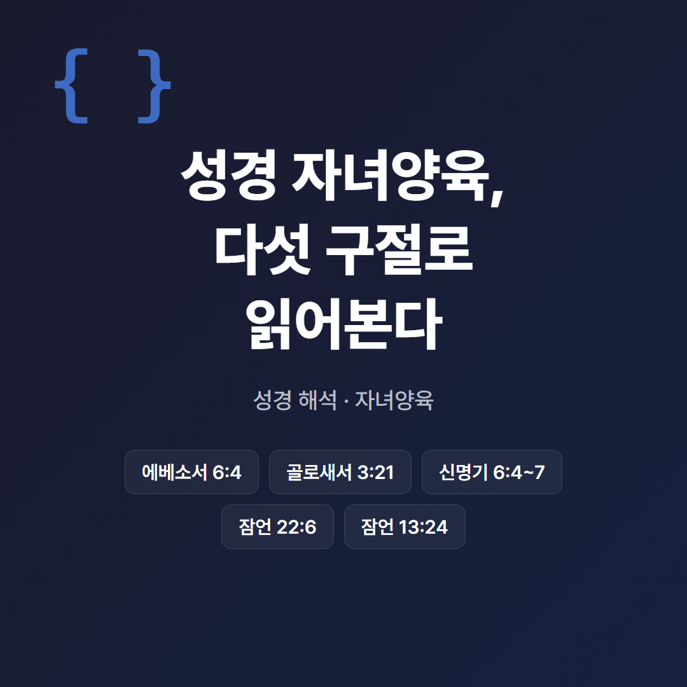
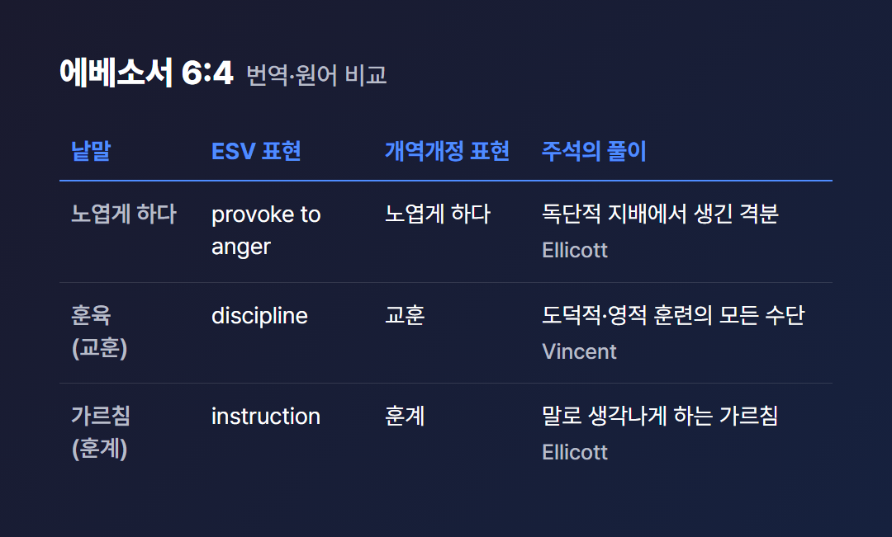
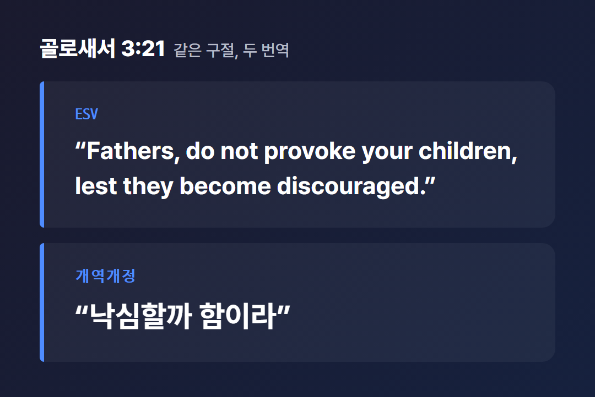
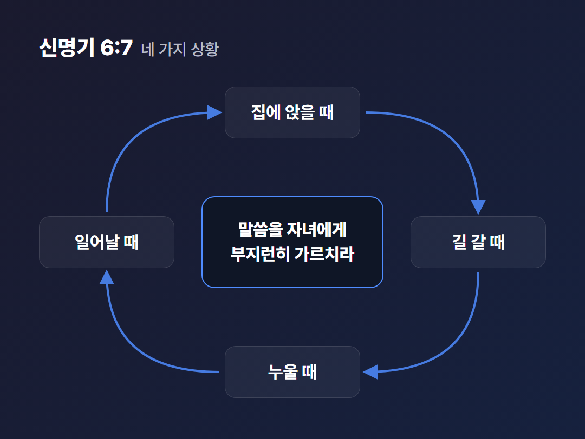
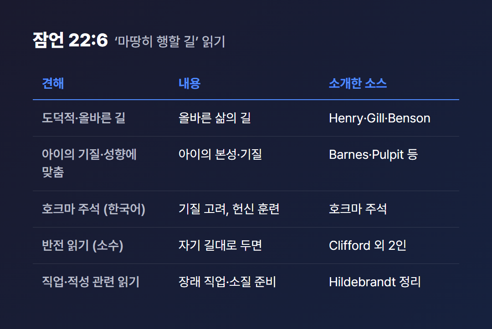
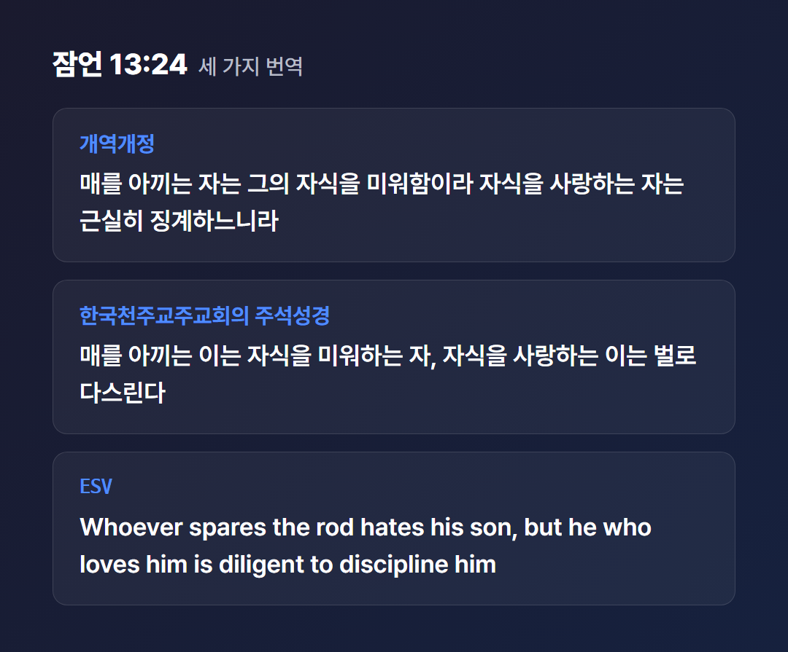

# 성경 자녀양육, 다섯 구절로 읽어본다

> 2026년 5월 기준으로 확인한 자료로 쓴 글이다. 성경 본문은 개역개정과 ESV만 확인했고, 주석은 대체로 17~19세기에 쓰인 고전 주석이 중심이다. 해석이 갈리는 곳은 양쪽을 함께 적었다.

“성경은 자녀를 어떻게 키우라고 하나요?”

이런 질문을 품고 이 글을 열었을 분들이 있을 것이다. 성경 자녀양육을 다룬 글은 많다. 그런데 구절마다 해석이 갈리는 곳이 있어서 한 문장으로 답하기가 어렵다.

그래서 이 글은 답을 하나로 모으지 않는다. 에베소서 6:4, 골로새서 3:21, 신명기 6:4~7, 잠언 22:6, 잠언 13:24. 이 다섯 구절이 무엇을 말하는지, 자료마다 어떻게 읽는지를 출처와 함께 옮긴다. 어느 해석이 옳은지는 나도 판정하지 않는다.

위 이미지는 이 글이 다루는 다섯 구절의 지도다. 아래에서 순서대로 하나씩 본다.

---

## 성경 자녀양육에서 ‘노엽게 하지 말라’는 말은?

에베소서 6:4는 자녀양육에 관해 아버지들에게 두 가지를 말한다. 자녀를 노엽게 하지 말라는 것, 그리고 주의 훈육과 가르침으로 양육하라는 것이다. 개역개정은 “또 아비들아 너희 자녀를 노엽게 하지 말고 오직 주의 교훈과 훈계로 양육하라”로 옮겼다.

이 자녀양육 구절은 금지만 한 게 아니라 적극 명령을 함께 둔 것이다. 하지 말 것과 할 것이 한 문장 안에 들어 있다.

문맥도 짚어 둘 만하다. 앞 문단인 6:1~3은 자녀가 주 안에서 부모에게 순종하라는 말이고, 6:2는 “아버지와 어머니를 공경하라”를 약속이 딸린 첫 계명으로 언급한다. 6:4가 이어서 아버지에게 말한다. 고전 주석들은 이 구절을 에베소서 5:22~6:3으로 이어지는 가정 안 관계 의무의 구조 속에 둔다.

낱말은 어떻게 풀릴까? ‘노엽게 하다(parorgizo)’를 Ellicott는 독단적이고 동정심 없는 지배에서 생기는 격분으로 설명한다. Meyer는 부당함, 거침, 성급한 기질에서 오는 짜증이라고 한다. Expositor's Greek는 계획적으로 화나게 하는 강한 동사로 본다.

‘훈육(paideia)’은 Vincent가 도덕적·영적 훈련에 기여하는 모든 수단을 아우르는 말로 본다. ‘가르침’은 Ellicott가 말로 ‘생각나게 하는’ 가르침으로 풀고, Pulpit은 훈육과 구별되는 가르침으로 본다.

번역본도 다르다. ESV는 “discipline and instruction”으로, 개역개정은 “교훈과 훈계”로 옮겼다. 단어도 순서도 같지 않다.

표는 같은 구절이 번역과 주석에서 어떻게 달라지는지를 한눈에 모은 것이다. 이 표의 풀이는 모두 위에서 확인한 주석에서 온 것이다.

그렇다면 왜 어머니가 아니라 ‘아버지들’일까? 주석은 두 갈래로 답한다. Alford, Barnes, Meyer, Cambridge는 아버지가 가정의 머리로서 권위와 자녀 훈련의 통치를 맡았기 때문이라고 본다. Bengel과 Jamieson-Fausset-Brown은 아버지가 어머니보다 격정에 더 쉽게 휩쓸리는 경향이 있기 때문이라고 본다.

하나는 권위 구조를, 다른 하나는 성향을 이유로 든다. 어느 쪽이 맞는지는 이 자료들로 가를 수 없다.

[TODO: 직접 경험 넣기 - 어린 시절 부모에게, 또는 자녀를 대하면서 ‘노엽다’고 느꼈거나 느끼게 했던 순간과 그때의 마음]

---

## 골로새서의 자녀양육 권면은 왜 ‘낙심’을 말할까?

골로새서 3:21(ESV)은 에베소서와 비슷한 자녀양육 권면에 이유를 붙인다. 노엽게 하지 말라는 금지 뒤에 낙심이 나온다.

> “Fathers, do not provoke your children, lest they become discouraged.”

개역개정은 같은 구절을 “아비들아 너희 자녀를 노엽게 하지 말지니 낙심할까 함이라”로 옮겼다. 에베소서 6:4에서는 ‘노엽게 하는 일’에 방점이 있다. 골로새서 3:21에서는 그 뒤에 올 결과로서의 의기소침이 명시된다.

박스에 담은 것은 같은 구절의 두 번역이다. 영어의 ‘discouraged’가 한국어 개역개정에서는 ‘낙심’이 된다.

문맥은 이렇다. 앞의 3:18~20은 아내, 남편, 자녀에게 주는 권면이고, 3:20은 자녀가 부모에게 순종하라는 말이다. 3:21이 아버지들에게 말한다. Cambridge는 아버지를 부모 권위의 ‘자연스러운 대표’로 보되 양 부모를 포함할 수 있다고 한다.

‘낙심(athymeo)’은 주석가마다 결이 조금씩 다르게 풀린다. Bengel은 꺾인 정신, 젊음의 해악이라고 한다. Barnes는 기쁘게 해드릴 수 있다는 소망을 잃고 용기를 잃는 것이라고 한다. Gill은 슬픔으로 정신이 꺾여 무기력해지는 것이라고 한다.

Pulpit은 한 걸음 더 나아간 함의를 짚는다. 부모의 권위를 잘못 쓰면 자녀가 아버지를 친구가 아닌 적으로 보게 될 수 있다는 것이다.

‘노엽게 하다’의 원어는 에베소서와 다르다. 여기서는 erethizo가 쓰였다. Cambridge는 ‘자극해 짜증나게 하다’로 풀고, Vincent는 고린도후서 9:2에서 이 낱말이 선행을 북돋운다는 뜻으로 쓰였으니 문맥이 중요하다고 한다.

Ellicott는 문맥에 따라 ‘경쟁심을 일으키다’로 읽힐 수 있는 쪽으로 서술하는 한편, 끊임없는 불안한 자극을 금한다는 데까지 말한다. 그 이상의 해석은 확인하지 못했다. Cambridge와 Pulpit은 짜증이나 분노를 일으키는 것으로 설명한다.

---

## 신명기 6:4~7의 자녀양육은 무엇을 가르치라 할까?

신명기 6:4~7은 말씀을 부모 자신의 마음에 먼저 두고, 자녀에게 부지런히 가르치며, 일상 어디서나 이야기하라고 명령한다. 이 구절은 쉐마로 불리는 6:4~9 안에 들어 있다.

개역개정 6:7은 “네 자녀에게 부지런히 가르치며”로 시작해 집에 앉았을 때, 길을 갈 때, 누워 있을 때, 일어날 때에 이 말씀을 강론하라고 잇는다. 네 가지 상황이 하루를 한 바퀴 돈다.

본문의 순서가 중요하다. 6:4~5의 쉐마는 하나님이 한 분이시며 마음·영혼·힘을 다해 사랑하라는 취지다(ESV). 이어서 6:6이 그 말씀을 먼저 부모 자신의 마음에 있게 하라고 한다. 자녀양육의 구체적 명령은 6:7에서 나온다.

자녀에게 가르치려면 말씀이 부모 마음에 있어야 한다. 그러려면 6:4~5의 고백이 앞에 서야 한다. 본문이 그 순서를 그렇게 놓았다.

‘가르치다(shanan)’는 어떤 낱말일까? Poole은 ‘갈다, 날카롭게 하다’라는 뜻이라서 마음속 깊이 꿰뚫게 하라는 뜻으로 풀었다. Gill은 반복과 계속적인 주입으로 보았고, Cambridge는 날카롭게 하여 자녀에게 새기는 것으로 풀었다.

칼을 숫돌에 가는 일을 떠올리면 쉽다. 한 번 문지르고 마는 게 아니라 여러 번 반복해서 날을 세운다. 다만 비유는 여기까지다. 아이는 칼이 아니다.

다이어그램의 네 방향은 본문의 네 상황이다. 주석에서 확인되는 것은 이 네 상황을 하루 전체로 읽는다는 점이다. Benson은 네 상황을 하루 전체로 풀었고, Matthew Henry는 모든 기회에 신적인 일을 대화하라고, Gill은 모든 기회에 하나님에 대한 지식을 심으라고 읽었다.

누가 가르치고 누구에게 가르치는지도 주석마다 범위가 다르다. Barnes는 부모를 가정 안의 교육자로 본다. Ellicott는 부모가 자녀가 물을 만한 질문에 즉시 답할 수 있어야 한다고 본다. Benson은 가르침이 자녀뿐 아니라 종, 친구, 동료에게까지 미친다고 본다.

Jamieson-Fausset-Brown은 이 체계가 종교를 가정생활의 모든 친숙한 것과 연결하도록 짜인 것이라고 보았다. Keil & Delitzsch는 계명이 늘 생각과 대화의 주제가 되어야 한다고 보았다.

[TODO: 직접 경험 넣기 - 집에서 신앙이나 말씀을 일상 대화로 나눈 경험, 혹은 그러지 못해 아쉬웠던 경험]

---

## 잠언 22:6 자녀양육의 ‘마땅히 행할 길’이란?

잠언 22:6은 아이에게 ‘마땅히 행할 길’을 가르치면 늙어도 그것을 떠나지 않는다고 말한다. 개역개정은 “마땅히 행할 길을 아이에게 가르치라 그리하면 늙어도 그것을 떠나지 아니하리라”로 옮겼다. ESV는 “Train up a child in the way he should go”로 시작한다.

문제는 ‘마땅히 행할 길’이 무엇이냐는 것이다. 자료에는 서로 다른 읽기가 있다. 어느 것도 이 글이 고르지 않는다.

도덕적이고 올바른 길로 읽는 견해가 있다. Matthew Henry Concise, Gill, Benson이 이쪽이다. Gill은 순종과 종교의 길로, Benson은 네가 아이가 택하기를 바라는 삶의 길로 풀었다. Hildebrandt는 McKane를 이 견해의 대표로 소개한다.

아이의 기질과 성향에 맞추는 읽기도 있다. Barnes는 각 아이의 기질을 연구하라고 보고, Pulpit은 아이의 본성·능력·기질을 고려한다고 본다. Cambridge는 개별 성격과 능력을, Keil & Delitzsch는 삶의 단계에 따른 규율을 말한다.

표는 자료에서 갈리는 다섯 가지 읽기를 소스와 함께 정리한 것이다.

호크마 주석(한국어)은 두 가지를 함께 취한다. ‘그의 길을 따라’가 원문의 문자적 뜻이라서 아이의 자질·성격·능력·잠재력·본성·기질을 고려해야 한다고 풀었다. 동시에 어려서부터 아이가 하나님께 헌신하는 삶을 살도록 훈련하라는 규범적 교훈으로 정리했다.

가장 눈에 띄는 것은 Hildebrandt가 소개하는 소수의 읽기다. 그는 히브리어 본문에 영어 ‘should(마땅히)’에 해당하는 낱말이 없고 ‘그의 길’이라고만 되어 있다고 소개한다(Douglas Stuart의 지적으로). Clifford, Stuart, Aiken의 읽기는 이 구절을 경고로 본다. 아이를 ‘자기 길’대로 내버려두면 늙어서도 거기서 벗어나지 못한다는 뜻이라는 것이다.

이 읽기는 일반 해석을 뒤집는다고 소개되며, 의도적 모호성일 수 있다는 의문도 함께 제시된다. 한편 도덕적 읽기를 취하는 주석은 같은 ‘그 길’을 올바른 길로 본다. 도덕적 수식어가 없다는 점을 의문의 근거로 드는 쪽과, 그래도 올바른 길로 읽는 쪽이 자료에 함께 있다.

이 구절은 자녀양육의 약속일까? 확인된 자료들은 같은 방향을 가리킨다. Poole은 보편적이고 필연적으로 참은 아니며 대체로 그렇다는 뜻이라고 했다. Gill은 어린 시절의 인상은 쉽게 지워지지 않고 사람은 보통 선한 길을 버리지 않는다는 뜻으로 설명했다.

호크마 주석은 절대적 약속이 아니라 교육의 원리, 곧 조건부 원리로 정리했다. Hildebrandt는 ‘잠언은 약속이 아니다’를 반복해서 강조하며, 약속으로 읽으면 자녀가 잘못되었을 때 부모를 자책으로 몰아넣는다고 짚는다. 반대로 이 구절이 부모에게 희망과 격려가 되어 왔다는 사용의 역사도 그는 언급한다.

이 구절을 절대적 약속으로 읽어야 한다는 주장은 확인한 자료에서 찾지 못했다. 참고로 Hildebrandt 자료는 영상 강의를 옮긴 한국어 전사본이라서 번역 투가 거칠고 일부 문장이 어색한데, 의미를 알 수 있는 부분만 옮겼다.

---

## 잠언 13:24 자녀양육의 ‘매’는 무엇을 뜻할까?

잠언 13:24의 자녀양육 권면은 매를 아끼는 자는 자식을 미워하는 자이고, 자식을 사랑하는 자는 근실히 징계한다고 말한다. ‘매’를 어떻게 읽을지는 자료마다 갈린다. 이 절은 확인된 자료가 말한 바만 옮기고, 이 글은 체벌을 권하지도 금하지도 않는다.

세 가지 번역을 놓고 보자. 개역개정은 “매를 아끼는 자는 그의 자식을 미워함이라 자식을 사랑하는 자는 근실히 징계하느니라”로 옮겼다. 한국천주교주교회의 주석성경은 “매를 아끼는 이는 자식을 미워하는 자, 자식을 사랑하는 이는 벌로 다스린다”로 옮겼다. ESV는 “Whoever spares the rod hates his son, but he who loves him is diligent to discipline him”이다.

세 카드는 같은 구절의 번역 차이만 보여준다. 새번역이나 공동번역 같은 다른 한국어 번역본은 확인하지 못했다.

문맥을 보면, 앞뒤 구절(13:23, 13:25)은 가난한 자의 밭, 의인의 식사 등 다른 주제다. 13:24는 부모의 징계를 사랑의 표현으로 다루며 방임과 대비하는 격언이다. 아버지에게 하는 말로 풀이되지만, Wegner는 잠언 29:15를 설명하며 이 책임이 어머니만의 것은 아니라고 본다.

원어는 어떨까? ‘매(shebet)’를 BDB와 KB3는 막대, 지팡이, 몽둥이, 홀로 풀이한다. NIDOTTE(Fouts)는 시문학에서 가장 흔한 쓰임이 권위자가 쓰는 징계의 막대라고 설명한다. 아버지의 교정 징계(잠언 13:24; 22:15; 23:13, 14; 29:15), 관원의 처벌(10:13), 하나님(욥기 21:9; 37:13)의 경우가 그렇다.

같은 사전은 출애굽기 21:20, 미가 4:14, 이사야 10:15 등에서 이 낱말이 때리는 데 쓰였고, 비유적으로 이스라엘에 대한 하나님의 징계에도 쓰인다고 한다. ‘근실히’에 해당하는 낱말은 간절히, 일찍, 부지런히 구한다는 뜻이다. 호크마 주석은 어릴 때부터 때를 맞춰 징계한다는 뜻으로 풀었고, Geneva Bible은 ‘betimes’를 ‘diligently’로도 옮길 수 있다고 한다.

고전 주석은 이렇게 나뉜다. Benson은 마땅한 징계를 하지 않는 것이며 맹목적 애정은 미움만큼 해롭다고 했다. Matthew Henry Concise는 죄악된 습관을 허용하는 거짓된 방임을 표현한다고 설명했다.

Jamieson-Fausset-Brown은 징계, 곧 실제 도구를 암시한다고 보았다. Poole은 애정이 있어도 결과는 미움과 같다고 했고, Gill은 어리석은 사랑이 실제 미움보다 나쁘다고 했다. Keil & Delitzsch는 처벌 수단이자 아버지의 권위로 보았다.

그렇다면 오늘의 연구자들은 어떻게 읽을까? 소스에서 확인되는 입장은 두 갈래다. 한쪽은 이 낱말을 때리는 도구와 연결해 읽는다. Wegner(Phoenix Seminary 구약 교수, JETS 2005)는 shebet가 때리는 도구로 쓰인 낱말이며 잠언의 매 구절이 일종의 체벌을 시사한다고 본다.

같은 Wegner는 이 낱말이 단순한 엉덩이 때리기보다 넓은 징계를 가리키게 되었을 가능성도 말한다. 징계는 이전 단계가 먹히지 않을 때 쓰는 수준으로 보고, 분노나 악의로 쓰는 것은 해당하지 않는다고 본다. 교정이 말, 명령, 이성적 논증으로도 이루어진다는 취지의 주석도 그는 소개한다. 호크마 주석 역시 쉬브토를 징계를 위한 매, 막대기로 풀이한다.

다른 쪽은 성경이 체벌을 요구하지는 않는다는 입장이다. Christianity Today의 2012년 1월 사설은 William J. Webb의 책 Corporal Punishment in the Bible을 인용해, 성경이 체벌을 ‘요구’하지는 않지만 금하지도 않는다는 논지를 소개한다. 같은 사설은 Albert Mohler가 체벌을 불순종과 처벌의 인과를 보여주는 것으로 옹호한다고도 소개하고, 잔인함과 분노 없이 마지막 수단으로 하라는 자체 권고를 낸다.

두 입장은 자료 안에 함께 있다. 나는 어느 쪽도 판정하지 않는다.

이 주제에는 성경 해석과 성격이 다른 현대 자료도 있다. 한국에서는 법무부가 2020년 8월 4일 민법 제915조의 징계권 조항을 삭제하는 개정안을 입법예고했다. 삭제 대상은 ‘필요한 징계’ 조항과 감화·교정기관 위탁 규정이다. 법무부는 이 조항이 부모 체벌을 정당화한다고 오해되는 것을 막기 위한 것이라고 밝혔다.

리걸타임즈는 2021년 1월 8일 국회에서 이 개정안이 의결되었다고 보도했다. 시행일은 기사에서 확인하지 못했다.

타임라인은 이 글이 확인한 현대 자료의 순서다. 국제 문서에서 UN 아동권리위원회는 2006년 일반논평 8호에서 체벌을 ‘아무리 가볍더라도 어느 정도의 고통이나 불편을 주려는 의도로 물리력을 쓰는 모든 처벌’로 정의했다. 같은 문서는 ‘합리적·온건한’ 체벌이 아동의 최선의 이익에 부합한다는 주장을 받아들이지 않는다고 쓴다.

미국소아과학회(AAP)는 2018년 정책 성명 “Effective Discipline to Raise Healthy Children”을 냈다. 이 성명에서 체벌이 효과가 없고 해롭다는 입장을 밝히고, 체벌 없이 긍정적 훈육 전략을 권했다. 이 내용은 HealthyChildren.org 기사로 확인했고, 정책 원문은 접근하지 못했다.

기독교 안의 논의와 이 자료들은 서로 성격이 다른 소스다. 이 글은 둘 사이의 우열이나 일치 여부를 따지지 않는다.

---

다섯 구절을 나란히 놓고 보니, 성경 자녀양육은 하나의 결론으로 묶이지 않는 곳이 여럿이었다. 아버지만 지목한 이유도, ‘마땅히 행할 길’도, ‘매’도 그렇다. 나는 그 갈림길에서 어느 쪽으로 가라고 말하지 않았다. 그럴 자격이 있는지 스스로도 확신하지 못한다.

다만 갈림길이 어디에 있는지는 보여주었기를 바란다. 내가 확인하지 못한 자료나 다른 번역본을 읽는 분은 다른 결론에 닿을 수도 있다. 그 가능성은 누구에게나 열려 있다.

그대가 성경 자녀양육의 다섯 구절을 다시 읽는다면 어느 구절에서 가장 오래 멈추게 될까?

---

## 참고 자료

- [Ephesians 6:1-4 (ESV)](https://www.biblegateway.com/passage/?search=Ephesians+6%3A1-4&version=ESV) — BibleGateway
- [Colossians 3 (ESV)](https://biblehub.com/esv/colossians/3.htm) — BibleHub
- [Deuteronomy 6 (ESV)](https://biblehub.com/esv/deuteronomy/6.htm) — BibleHub
- [Proverbs 22 (ESV)](https://biblehub.com/esv/proverbs/22.htm) — BibleHub
- [Proverbs 13 (ESV)](https://biblehub.com/esv/proverbs/13.htm) — BibleHub
- [개역개정 성경 본문](https://www.bskorea.or.kr/bible/korbibReadpage.php?version=GAE&book=pro&chap=13&sec=24) — 대한성서공회
- [Ephesians 6:4 Commentaries](https://biblehub.com/commentaries/ephesians/6-4.htm) — BibleHub, 고전 주석 모음(연도 미확인)
- [Colossians 3:21 Commentaries](https://biblehub.com/commentaries/colossians/3-21.htm) — BibleHub, 고전 주석 모음(연도 미확인)
- [Deuteronomy 6:7 Commentaries](https://biblehub.com/commentaries/deuteronomy/6-7.htm) — BibleHub, 고전 주석 모음(연도 미확인)
- [Proverbs 22:6 Commentaries](https://biblehub.com/commentaries/proverbs/22-6.htm) — BibleHub, 고전 주석 모음(연도 미확인)
- [Proverbs 13:24 Commentaries](https://biblehub.com/commentaries/proverbs/13-24.htm) — BibleHub, 고전 주석 모음(연도 미확인)
- [Discipline in the Book of Proverbs: "To Spank or Not to Spank?"](https://etsjets.org/wp-content/uploads/2010/06/files_JETS-PDFs_48_48-4_JETS_48-4_715-732.pdf) — Paul D. Wegner, Journal of the Evangelical Theological Society 48/4, 2005-12
- [잠언 22:6 – 자녀를 훈련시키십시오](https://biblicalelearning.org/wp-content/uploads/2024/02/Hildebrandt_KO_Prov22_6_Korean.pdf) — Ted Hildebrandt, Biblical Elearning, 2024
- [호크마 주석, 잠언 13장](https://hangl.net/com_kor_hochma/140801) — 호크마 주석과 강해
- [호크마 주석, 잠언 22장](https://hangl.net/com_kor_hochma/140819) — 호크마 주석과 강해
- [Thou Shalt Not Abuse: Reconsidering Spanking](https://www.christianitytoday.com/2012/01/editorial-spanking-abuse/) — Christianity Today, 2012-01
- [주석 성경 잠언 13장](https://bible.cbck.or.kr/Knbnotes/Bible/Prv/13) — 한국천주교주교회의
- [General Comment No. 8 (2006)](https://hrlibrary.umn.edu/crc/comment8.html) — UN 아동권리위원회, 2006
- [AAP Updates Corporal Punishment Policy](https://www.healthychildren.org/English/news/Pages/AAP-Updates-Corporal-Punishment-Policy.aspx) — HealthyChildren.org, 2018-11
- [법무부, 부모 '징계권 조항' 삭제한 민법 개정안 입법예고](https://www.korea.kr/news/policyNewsView.do?newsId=148875494) — 정책브리핑, 2020-08-05
- [민법의 징계권 조항 삭제…체벌금지 명확화](https://www.legaltimes.co.kr/news/articleView.html?idxno=57776) — 리걸타임즈, 2021-01-09

---

#성경자녀양육 #자녀양육 #에베소서 #골로새서 #신명기 #쉐마 #잠언 #성경해석

<!-- 발행 메모 (블로그에 올릴 때는 이 아래를 지운다)
제목: 성경 자녀양육, 다섯 구절로 읽어본다 (20자)
핵심 키워드: 자녀양육(성경 자녀양육) / 본문 글자 수(공백 제외, 도입~마무리, [IMAGE]·[TODO]·참고 자료·태그 제외): 6,300자 / 키워드 횟수: 14회 (밀도 약 0.9%, 글자 수 기준 계산. 가이드 목표 1.5~3%에는 못 미침)
이미지 자리: 7개
직접 채울 곳([TODO]): 엡 6:4 단락 끝(노엽게 했거나 노여웠던 순간), 신 6:7 단락 끝(일상에서 신앙을 나눈 경험)
research.md에 없어서 뺀 내용: 잠 13:24 '매'의 상징설, 영어 속담 연관, 한국 민법 개정 시행일(확인 못함), 새번역·공동번역 본문(확인 못함), 최근 학술 주석(Waltke 등), 호크마 hanak 풀이, 교육 시간표식 해석, 전 세계 체벌 금지국 수치([22][23])
research.md의 정보 충돌을 어떻게 다뤘는지: 아버지만 지목한 이유(권위 구조 vs 성향), 골 3:21 erethizo(Ellicott는 확인된 범위까지만), 잠 22:6 해석 5갈래와 약속 여부, 잠 13:24 체벌 연결 읽기 vs 요구하지 않는다는 입장을 출처와 함께 병기하고 판정하지 않음
발행 전 확인: 이미지 7개 제작, [TODO] 두 곳 채우기, 외국인 이름은 research 표기(영문)를 그대로 사용했으니 필요 시 한글 표기 통일, 소제목에 키워드를 넣은 것이 어색한지 한 번 소리 내어 읽어보기
-->
