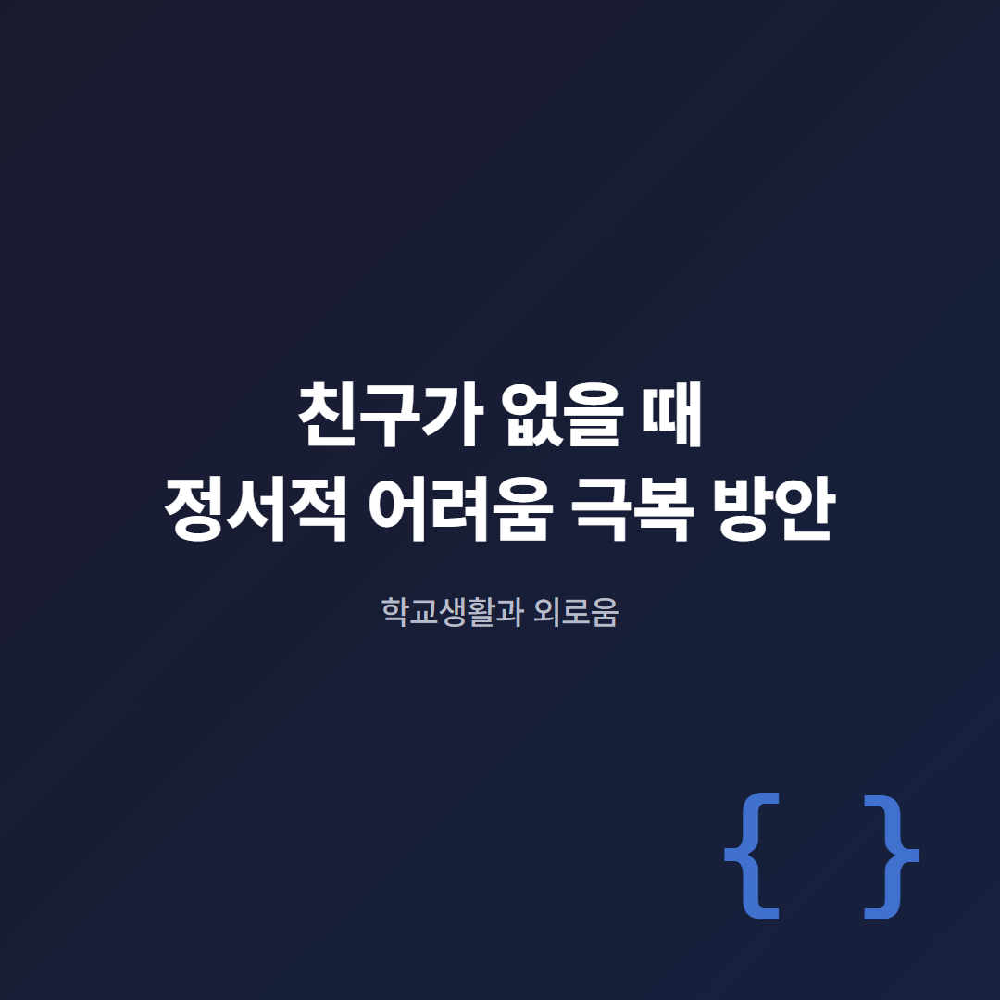
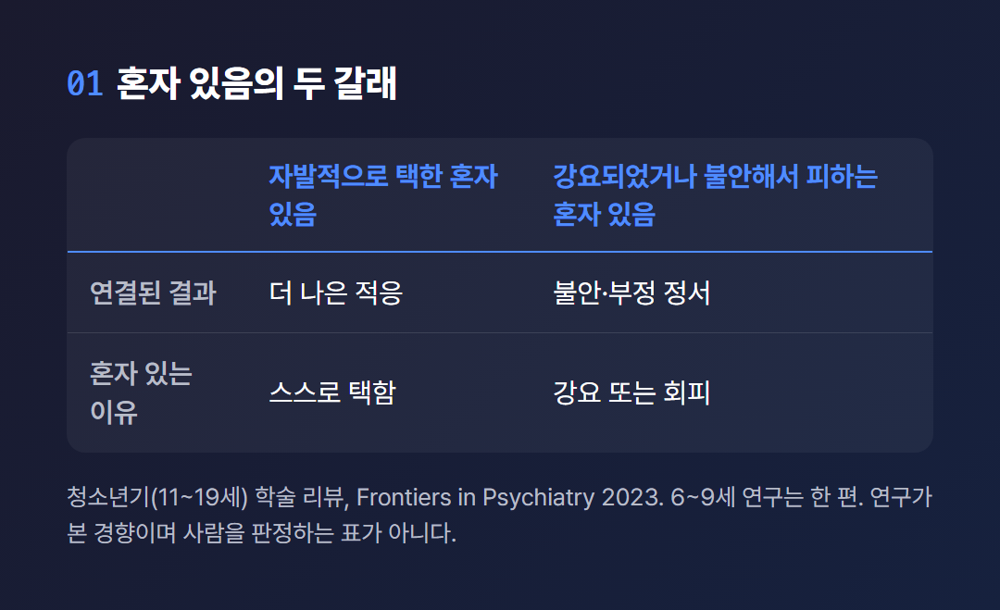
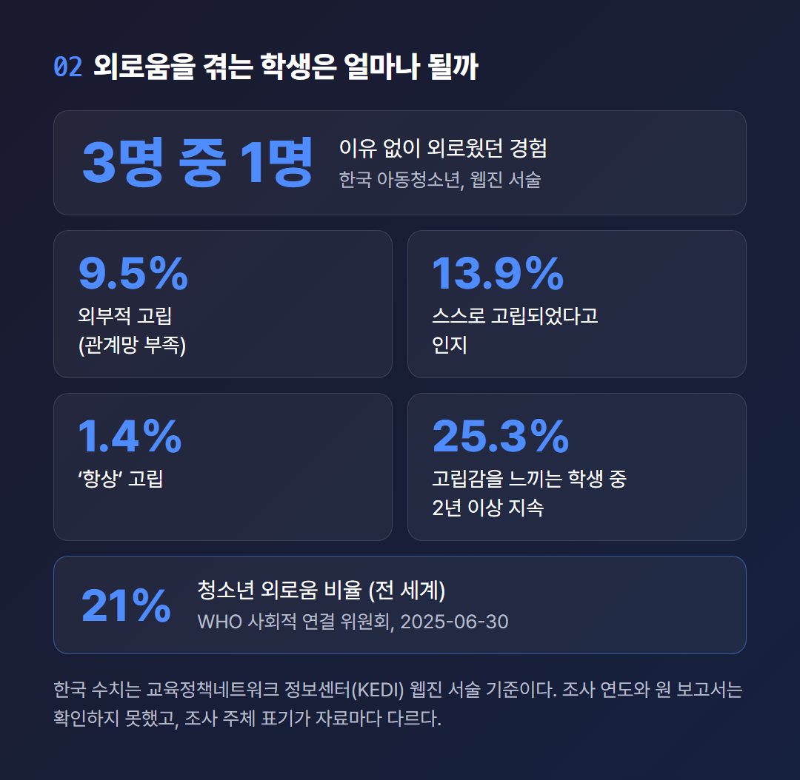
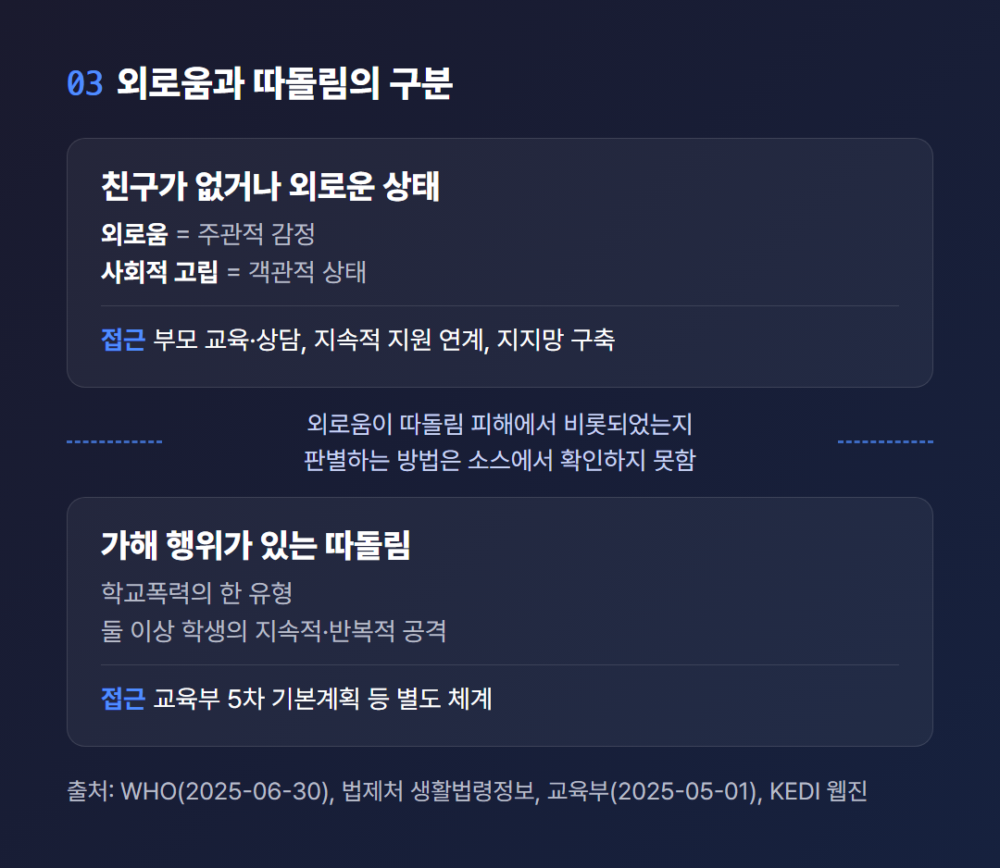
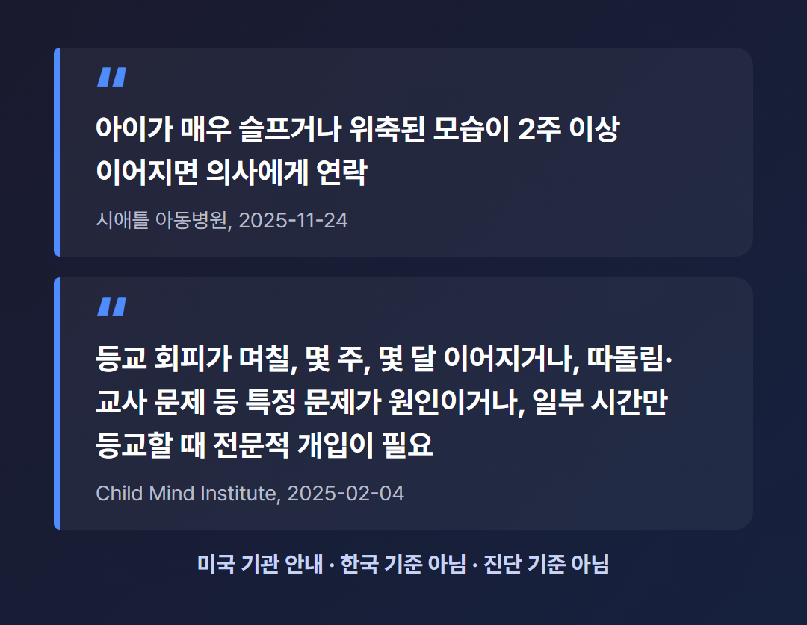

# 친구가 없을 때 정서적 어려움 극복 방안

> 2026년 10월 기준으로 쓴 글이다. 한국 통계 일부는 발행일을 확인하지 못한 웹진에 기대고 있고, 효과 연구 한 편은 동료심사 전 프리프린트다. 진단이나 치료를 말하는 글이 아니며, 방법마다 근거 소스의 성격을 함께 적었다.

“친구가 없을 때, 학교에서는 어떻게 지내야 하나요?”

이런 질문을 품은 학생이 있을 것이다. 그 곁에서 같은 질문을 속으로 삼키는 부모와 교사도 있을 것이다.

이 글은 하나의 흐름으로 간다. 먼저 외로움이 무엇인지 보고, 통계를 보고, 따돌림과의 구분을 짚는다. 그다음 학생, 부모, 교사에게 차례로 말을 건넨다. 학생에게는 ‘그대’라고 부르고, 어른에게는 ‘부모와 교사 분들’이라고 부르겠다.

공공기관, 국제기구, 연구 자료에 적힌 것만 옮겼다. 자료에 없는 요령은 만들지 않았다. 확인하지 못한 것은 확인하지 못했다고 쓴다.

[TODO: 직접 경험 넣기 - 학창 시절 친구 문제로 힘들었거나 곁에서 지켜본 경험이 있다면, 감정 없이 사실만 두세 문장]

아래 그림은 이 글 전체에서 쓰는 두 개념을 WHO의 구분대로 나란히 놓은 것이다. 설명은 첫 번째 소제목에서 이어진다.

---

## 친구가 없으면 곧 외로운 걸까?

곧바로 같다고 보기는 어렵다. WHO는 외로움을 “원하는 연결과 실제 연결 사이 격차에서 오는 주관적이고 고통스러운 감정”으로 정의한다. 사회적 고립은 관계와 역할, 상호작용이 적은 객관적 상태로 따로 구분한다.

외로움은 친구가 몇 명이냐를 세어서 나오는 숫자가 아니라, 바라는 관계와 실제 관계의 간격에서 나오는 감정이다. 이 정의에서 보면 친구가 적어도 바라는 수준과 맞으면 외로움과는 다를 수 있다. 다만 이 해석을 직접 밝힌 문장은 소스에 없고, 정의에서 내가 추론한 것이다.

혼자 있음(solitude)도 외로움과 구분된다. 청소년기(11~19세)를 다룬 학술 리뷰는 혼자 있을 때 화면 시청, 숙제, 음악 듣기를 주로 한다고 정리한다. 이 리뷰에서 자발적으로 택한 혼자 있음은 더 나은 결과와 이어졌다. 강요된 혼자 있음이나 불안한 사회 상황을 피하려는 혼자 있음은 불안과 부정적 정서와 이어졌다.

그러니 친구가 없을 때 중요한 것은 혼자인가 아닌가가 아니라, 왜 혼자인가이다. 연구 용어로 사교를 크게 원하지 않아 혼자인 청소년이 사회적 상황을 피하려는 또래보다 나은 결과를 보였다는 대목도 있다. 한계도 분명하다. 6~9세 아동기를 다룬 연구는 이 리뷰에서 한 편뿐이라, 초등 저학년에 그대로 옮기기는 어렵다.

위 표는 그 리뷰의 결과를 두 갈래로 줄인 것이다. 사람의 상태를 판정하는 표가 아니라, 연구가 본 경향을 정리한 표다.

친구의 수와 질은 어떨까? 토론토 메트로폴리탄대 Ryan J. Persram은 2026년 9월 The Conversation에 기존 연구를 종합한 글을 썼다. 높은 질의 우정은 사회·정서적 어려움의 완충이 될 수 있고, 영향도 더 오래 갈 수 있다고 한다.

친구가 많을수록 불안과 우울이 적게 나타나는 현상은, 질 높은 관계가 하나라도 생길 가능성이 커지기 때문일 가능성이 크다고 그는 설명한다. 그렇다고 친구 수가 전혀 무관하다는 말은 아니다. 좋은 우정에도 갈등은 있다. 이 글은 전문가가 쓴 종합 해설이지 단일 원저 연구가 아니라는 점도 밝혀 둔다.

---

## 외로움을 겪는 학생은 얼마나 될까?

한국 조사를 인용한 웹진에 따르면 아동청소년 3명 중 1명이 ‘이유 없이 외로웠던 경험’이 있다. 이 수치에는 단서가 붙는다. 조사 주체와 한계를 함께 적는다.

이 웹진은 교육정책네트워크 정보센터(KEDI)에 실린 글이다. 발행일은 확인하지 못했다. 웹진은 해당 조사를 ‘통계청 국가승인통계 아동청소년 인권실태조사’로 서술하고, 사회적 관계망과 외로움 항목은 2023년에 추가되었다고 쓴다. 그런데 여성가족부의 「2025 청소년 통계」 보도자료(2025년 5월 27일 발표)는 같은 조사를 한국청소년정책연구원의 아동·청소년 인권실태조사로 표기한다.

두 표기가 다른 이유를 나는 알 수 없다. 어느 쪽이 맞는지 판정하지 않는다. 원 보고서는 열람하지 못했고, 표본의 상세와 이 수치의 조사 연도도 확인하지 못했다. 인용하려는 분들은 원 보고서를 먼저 확인하기를 권한다.

웹진은 코로나19 이후 초등학생과 중학생의 외로움 경험 비율이 올랐고, 초등학생의 증가 추세가 중고생보다 두드러진다고 해석한다. 고립감을 느끼는 학생 중 4명 중 1명(25.3%)은 그 상태가 2년 이상 이어졌다. 초·중·고를 나란히 비교한 한국 수치는 확인하지 못했다.

위 카드의 수치는 모두 웹진과 WHO 자료가 적은 그대로다. 외부적 고립 9.5%는 관계망 부족을 가리키며, 웹진 표기상 문항은 “어려운 상황에서 외면하지 않는 사람이 없다”이다. 스스로 고립되었다고 인지하는 내부적 고립은 13.9%, ‘항상’ 고립은 1.4%다.

국제 수치도 있다. WHO 사회적 연결 위원회 보고서(2025년 6월 30일)는 청소년과 청년이 외로움 비율이 가장 높고 나이가 오를수록 대체로 낮아진다고 설명한다. 청소년 비율은 21%다. 연령 구간별 세부 수치는 직접 확인하지 못했다.

외로움은 어디서 오는 걸까? 웹진이 꼽은 영향 요인은 아동기의 부정적 생애경험, 과도한 학업 스트레스와 경쟁, 비대면 관계의 증가와 공동체 변화, 도움을 요청했지만 적절한 지원으로 이어지지 못한 경험이다. 이 목록에는 학생 개인의 성격이 들어 있지 않다. 친구가 없다는 사실을 학생 본인의 결함으로 읽을 근거를 이 자료들에서 찾지 못했다.

외로움이 학교생활에 어떤 영향을 주는지도 짚어 둔다. WHO는 연결감을 느끼는 학생의 학교 성적이 더 낫다고 서술한다. 아동정신건강 기관인 미국 Child Mind Institute는 사회적 어려움을 등교 거부의 유발 요인 중 하나로 설명한다. 외로움과 학업의 관계를 다룬 연구들이 더 있는 듯하나, 본문을 열람하지 못해 쓰지 않는다.

한국청소년정책연구원은 2025년 4월 15일 「고립·은둔 청소년 삶 실태 및 정책 과제」를 발표했다. 이 글이 다루는 범위를 넘는 주제지만, 기초자료 구축과 지원 인프라, 법률·조례 제정을 정책제언으로 담았다는 점만 적어 둔다.

---

## 따돌림과 외로움은 어떻게 다를까?

둘은 같은 말이 아니다. 친구가 없을 때의 외로움은 감정 상태이고, 따돌림은 법에 정의된 학교폭력의 한 유형이다. 학생과 곁의 어른 모두에게 해당하는 구분이다.

법제처 생활법령정보에 따르면 학교폭력예방법상 학교폭력에는 따돌림이 포함된다. 둘 이상의 학생이 특정 학생을 지속적이고 반복적으로 신체적·심리적으로 공격해 고통을 주는 행위가 그 내용이다. 외로움은 이 법의 범주에 들지 않는다.

소스가 보여주는 구분의 틀은 이렇다. 하나는 친구가 없거나 외로운 상태다. 다른 하나는 가해 행위가 있는 따돌림이다. 접근도 다르다.

위 도식에서 눈여겨볼 곳은 가운데 점선이다. 외로움이 따돌림 피해에서 비롯되었는지 가려내는 방법을 이 글의 소스에서는 확인하지 못했다. 그래서 스스로 판단하기 어려울 때를 위한 길을 따로 안내한다.

따돌림에는 별도의 대응 체계가 있다. 교육부는 2025년 5월 1일 제5차 학교폭력 예방 및 대책 기본계획(2025~2029)을 발표했다. 학교·교원·학부모의 예방 역량 강화, 관계 회복과 정서·사회성 발달 중심의 예방, 가해학생 조치 개편, 학생 위기상담 강화가 들어 있다. 학교폭력 법령 관련 안내는 국민신문고(epeople.go.kr) 같은 정부 창구로 이어진다고 생활법령정보는 안내한다.

두 가지를 가르는 일이 어렵더라도 길은 막히지 않는다. 위(Wee) 클래스 대상 안내에는 학교폭력, 따돌림, 대인관계 미숙이 함께 들어 있고, 청소년상담 1388의 상담 주제에도 친구 문제와 학교폭력이 나란히 있다. 어느 쪽인지 몰라도 문을 두드릴 수 있다는 뜻이다.

---

## 친구가 없을 때 학생, 부모, 교사는 무엇을 할 수 있을까?

자료가 말하는 방법은 있다. 그러나 어느 것도 ‘이렇게 하면 해결된다’는 약속이 아니다. 근거의 성격이 모두 다르기 때문이다.

방법을 고르려면 근거의 성격을 알아야 한다. 그러려면 어디서 나온 말인지 가려야 한다. 그래서 방법마다 출처의 성격, 곧 연구인지 기관 권고인지 정책 제언인지를 붙인다.

위 표는 이 대목 전체의 지도다. 아래에서 대상별로 하나씩 풀어 쓴다.

### 학생에게

여기서는 학생인 그대에게 말한다. 친구가 없을 때 쓸 수 있는 방법부터 찾고 싶었을 것이다. 먼저 솔직히 밝힌다. ‘이렇게 하면 친구가 생긴다’는 구체적 요령은 공공기관과 학회 소스에서 확인하지 못했다. 그래서 만들어 쓰지 않는다.

확인된 것은 몇 가지다. 청소년기의 혼자 있음을 다룬 학술 리뷰에서는 혼자 있는 시간에 무언가를 하는 쪽이 아무것도 하지 않는 쪽보다 적응에 나았다. 그리고 혼자 있는 이유가 중요했다. 이것은 연구가 본 경향이지 그대를 판정하는 기준이 아니다.

WHO는 개인과 관계 수준의 전략으로 사회기술훈련과 인지행동치료 같은 접근을 분류한다. 관계를 맺고 유지하는 능력을 기르는 접근이라는 설명이다. 이름만 소개하는 것이며, 어느 것이 그대에게 맞는지는 이 글이 판단할 수 없다.

혼자 감당하기 어려우면 학교의 위(Wee) 클래스에서 전문상담교사에게 신청하거나 청소년상담 1388을 이용할 수 있다. 이 창구들은 마지막 소제목에서 따로 정리한다. 이 대목에서 공공기관이 직접 안내하는 것은 이 창구들이다.

### 부모에게

이 대목은 부모 분들에게 하는 말이다. 근거는 미국 시애틀 아동병원의 보호자용 안내(2025년 11월 24일)다. 기관 권고이며 한국 기관의 안내가 아니다. 한국 공공기관의 부모용 구체 안내는 확인하지 못했다.

이 안내는 자녀의 관심사와 취미에 관심과 인정을 보이라고 한다. 식사나 게임의 밤 같은 가족 루틴과 전통으로 소속감과 안정감을 만들라고도 한다. 부모가 공감과 타협, 감정 알아차리기를 직접 보여주고, 이야기나 영화로 긍정적인 사회적 상호작용을 강화하라는 권고도 있다.

등교를 피하는 아이는 어떻게 대할까? Child Mind Institute의 글(임상 전문가 작성·검토, 2025년 2월 4일 갱신)은 비난 없이 듣고 원인을 파악하며 교사와 이야기하라고 한다. 장기 결석을 방치하지 않는 것도 중요하다고 한다. 결석이 길수록 복귀가 어렵기 때문이다.

한국 자료에서는 부모 교육·상담 강화가 필요하다는 정책 방향이 나온다. 이것은 부모 개인의 요령이 아니라 정책 방향의 제언이다. 이 두 해외 소스는 한 가정의 사정을 모두 알고 쓴 글이 아니다. 참고로만 삼기를 권한다.

[TODO: 직접 경험 넣기 - 자녀·학생의 친구 문제를 곁에서 마주했던 경험이 있다면, 그때 한 일과 그 결과를 형용사 없이 사실로만]

### 교사와 학교에

이 대목은 교사 분들과 학교에 하는 말이다. 교육부는 교내에 위(Wee) 클래스, 교육청 산하에 위 센터, 중·장기 치유가 필요한 학생을 위한 위 스쿨을 운영한다. 학교폭력 맥락의 계획에는 관계 회복과 정서·사회성 발달 중심의 예방, 학생 위기상담 강화가 들어 있다.

한국 웹진은 도움을 요청한 학생이 지속적인 지원으로 이어져야 한다고 제언한다. WHO는 연결감 있는 학교 환경을 이야기한다. 어느 쪽이든 방향의 제시일 뿐, 교실에서 무엇을 어떻게 하라는 단계별 방법은 소스에 없다. 그래서 만들어 쓰지 않았다.

### 학교 프로그램은 효과가 있을까?

효과를 보고한 연구가 있다. 다만 한계도 함께 보아야 한다. 학교 기반 외로움 개입을 모은 메타분석(meta-analysis)이 대표적이다.

이 연구는 의학 논문 사전공개 서버 medRxiv에 2026년 4월 16일 올라온 프리프린트(preprint)다. 동료심사를 거치지 않았다는 뜻이다. 1993~2025년 발표된 38편, 참가자 16,698명을 모았고 무작위 대조 19편, 비무작위 10편, 단일군 9편이 포함되었다.

전체 합산 효과는 유의했다(g = -0.42, 95% 신뢰구간 -0.71~-0.13). 유형별로는 심리적 개입 g = -1.18, 사회정서기술훈련 g = -0.41, 또래 지원 g = -0.24였다. 사회적·정서적 지지는 효과가 미미하거나 중립이었다.

같은 연구가 밝힌 한계도 크다. 연구 간 이질성(I²)이 86%로 높았고, 이상치를 빼도 62%였다. 예측구간은 -2.00~1.17로 0을 포함한다. 개별 개입이 모든 환경에서 효과를 낸다고 일반화하기 어렵다는 취지다. 시행 강도와 충실도 보고가 미흡했고, 63%가 ‘약한’ 질로 평가되었으며, 다수가 파일럿이었다.

위 카드는 두 연구의 숫자를 좌우로 놓은 것이다. 한쪽만 읽으면 오해하기 쉬워서 나란히 두었다. 두 소스를 서로 판정하지 않고 함께 전한다.

다른 하나는 영국 초등 1~2학년 대상 사회정서학습 교육과정 PATHS의 무작위 대조시험이다. 2021년 12월 Frontiers in Education에 발표되었고, 45개 학교 6~8세 5,218명이 참여했다. 2년 후 개입 학교의 아동이 ‘외롭지 않다’ 또는 ‘거의 외롭지 않다’고 답할 가능성이 유의하게 높았다.

여기에도 한계가 있다. 실제 수업은 권장인 주 2회보다 적은 주 1회 정도였고, 분석은 준수 여부를 반영하지 않았다. 대상이 6~8세라서 이 연구만으로 더 높은 학령을 말할 수는 없다.

---

## 어디에 도움을 청할 수 있을까?

친구가 없을 때 기댈 수 있도록 소스가 안내하는 공공 창구가 있다. 청소년상담 1388, 위(Wee) 클래스와 센터, 정신건강 관련 상담전화가 그것이다. 따돌림이 의심될 때도, 그냥 마음이 무거울 때도 문을 두드릴 수 있다.

위 표를 글로도 풀어 둔다. 청소년상담 1388은 여성가족부가 운영하며 9~24세 청소년과 학부모·보호자, 기관 담당자가 대상이다. 학업·진로, 친구 관계, 가족, 학교폭력, 성폭력, 가출 상담을 하고 365일 24시간 열려 있다. 위기 시에는 긴급 지원과 기관 연계가 있다.

이용 방법은 지역번호와 1388로 전화하거나, 1388로 문자를 보내거나, 카카오톡 채널을 쓰는 것이다. 페이스북·인스타그램 메시지와 www.1388.go.kr도 안내된다. 지자체 센터의 한 예로 성남시청소년청년재단은 031-756-1388로 교우관계와 학업 고민을 무료로 받는다. 평일 9~18시는 본 센터가, 야간·주말·휴일은 경기도청소년상담복지센터가 응대한다고 안내한다.

학교 안에는 위(Wee) 클래스가 있다. 학생이 담당 전문상담교사에게 신청한다. 위 센터는 학교나 학생이 유선으로 신청하며, 문의는 교육부 콜센터 1588-2188 또는 02-721-0600이다. 위 스쿨은 학교와 센터를 통해 의뢰한다. 위 클래스와 센터의 이용 비용은 본문에서 직접 확인하지 못했다.

마음이 많이 힘들 때는 보건복지부의 정신건강 위기상담전화 1577-0199 또는 129(보건복지상담센터)가 있다. 자살 위기상담, 정신건강 상담, 정신건강 자원 정보 안내, 정신과 시설 연계를 맡는다. 거주지 시·군·구의 정신건강복지센터는 지역에 따라 아동·청소년 대상 서비스를 운영한다.

전문가의 도움은 언제 청하면 좋을까? 한국 공공기관 소스에서 기간이나 기능 저하의 기준을 직접 제시한 문서는 확인하지 못했다. 한국에서는 위 창구의 상담이 출발점으로 안내되어 있다. 아래는 모두 미국 기관의 안내이며 한국의 기준이 아니다.

위 박스는 두 기관이 적은 신호를 그대로 옮긴 것이다. 시애틀 아동병원 안내는 아이가 매우 슬프거나 위축된 모습이 2주 이상 이어지면 의사에게 연락하라고 하며, 우울일 수 있다는 설명을 붙인다. Child Mind Institute는 등교 회피가 이어지거나 따돌림 같은 특정 문제가 원인일 때 전문적 개입이 필요하다고 본다. 이 신호들은 진단 기준이 아니라 도움을 청할 때를 가늠하는 참고다. 진단과 치료는 이 글이 다루지 않는다.

---

친구가 없을 때 학생에게 가장 먼저 필요한 것은 무엇일까? 새 친구일 수도 있고, 말을 건넬 수 있는 어른 한 사람일 수도 있다. 이 글의 자료는 그 답을 하나로 정해 주지 못한다. 친구가 없는 학생을 곁에서 지키는 일에는 정답표가 없다.

내 정리가 전부는 아닐 것이다. 다른 자료와 다른 경험에서 더 나은 길을 찾은 분들도 있을 것이다. 그런 이야기를 나도 듣고 싶다. 다만 이 자료들이 공통으로 보여주는 것이 하나 있다. 문을 두드릴 창구가 이미 열려 있다는 사실이다.

그대는 지금 누구에게 첫마디를 건넬 수 있겠는가?

---

## 참고 자료

- [아동청소년 사회적 고립 현황 및 정책 방향](https://edpolicy.kedi.re.kr/edpolicy/webzine/42/841674) — 교육정책네트워크 정보센터(KEDI) 월간 교육정책포럼, 발행일 미확인
- [고립·은둔 청소년 삶 실태 및 정책 과제](http://nsp.nanet.go.kr/plan/subject/detail.do?nationalPlanControlNo=PLAN0000054184) — 한국청소년정책연구원(NYPi), 2025-04-15
- [Social connection (Q&A) / WHO Commission on Social Connection](https://www.who.int/news-room/questions-and-answers/item/social-connection) — WHO, 2025-06-30
- [위(Wee) 클래스 상담 지원](https://www.gov.kr/portal/service/serviceInfo/134200005007) — 정부24(교육부 학생정서지원과), 발행일 미확인
- [무엇이든 물어보세요 '청소년상담 1388'](https://www.korea.kr/news/policyNewsView.do?newsId=148940556) — 대한민국 정책브리핑(여성가족부), 2025-03-17
- [정신건강 복지센터 및 정신건강상담전화 운영](https://www.mohw.go.kr/menu.es?mid=a10706040100) — 보건복지부, 발행일 미확인
- [제5차 학교폭력 예방 및 대책 기본계획(2025~2029) 발표](https://www.moe.go.kr/boardCnts/viewRenew.do?boardID=294&boardSeq=103265&lev=0&searchType=null&statusYN=W&page=2&s=moe&m=020402&opType=N) — 교육부, 2025-05-01
- [학교폭력의 개념(학교폭력예방법)](https://www.easylaw.go.kr/CSP/CnpClsMain.laf?csmSeq=1408&ccfNo=1&cciNo=1&cnpClsNo=1) — 찾기쉬운 생활법령정보(법제처), 발행일 미확인
- [Evaluating the impact of school-based interventions on youth loneliness: A systematic review and meta-analysis](https://www.medrxiv.org/content/10.64898/2026.04.15.26349177v1.full) — medRxiv 프리프린트(동료심사 전), 2026-04-16
- [PATHS와 아동 외로움(영국 RCT)](https://www.frontiersin.org/journals/education/articles/10.3389/feduc.2021.791438/full) — Frontiers in Education, 2021-12
- [Are you alone? Measuring solitude in childhood, adolescence, and emerging adulthood](https://pmc.ncbi.nlm.nih.gov/articles/PMC10156970/) — Frontiers in Psychiatry, 2023-04-20
- [How high-quality friendship supports teen well-being](https://theconversation.com/how-high-quality-friendship-supports-teen-well-being-289265) — Ryan J. Persram(토론토 메트로폴리탄대), The Conversation, 2026-09
- [3 Ways to Help Your Child or Teen Feel Less Lonely](https://www.seattlechildrens.org/healthy-tides/help-child-feel-less-lonely/) — Seattle Children's, 2025-11-24
- [Recognize & Address School Refusal in Children](https://childmind.org/article/when-kids-refuse-to-go-to-school/) — Child Mind Institute, 2025-02-04(갱신)
- [「2025 청소년 통계」 발표](https://www.mogef.go.kr/nw/rpd/nw_rpd_s001d.do?mid=news405&bbtSn=710528) — 여성가족부, 2025-05-27
- [청소년전화 1388(상담지원)](https://www.snyouth.or.kr/fmcs/424) — 성남시청소년청년재단 청소년상담복지센터, 발행일 미확인

---

#친구가없을때 #학교외로움 #청소년외로움 #사회적고립 #학교폭력과외로움 #청소년상담1388 #위클래스 #학생정서지원 #또래관계

<!-- 발행 메모 (블로그에 올릴 때는 이 아래를 지운다)
제목: 친구가 없을 때 정서적 어려움 극복 방안 (22자)
핵심 키워드: 친구가 없을 때 / 본문 글자 수(공백 제외, 제목·기준일·IMAGE·TODO·참고자료·태그 제외): 5,885자 / 키워드 횟수: 정확 일치 7회(밀도 0.71%), 변형 '친구가 없' 계열 11회, '외로움' 17회 / 변형·연관어 합산 밀도 약 1.6% (계산: ('친구가 없' 11회x4자 + '외로움' 17회x3자) / 5,885자)
이미지 자리: 8개
직접 채울 곳([TODO]): 도입부(학창 시절·곁에서 지켜본 경험), 부모 소제목 끝(자녀·학생 친구 문제를 마주한 경험)
research.md에 없어서 뺀 내용: 학생용 구체적 친구 사귀기 요령, 한국 기관의 부모용 구체 요령, 교사용 단계별 방법, 위 클래스·센터 비용(확인 못함 명시)·출석 인정 여부, 한국 기관의 기간·기능 저하 기준, 외로움과 따돌림 판별법, 고등학생 별도 수치, 미국 위기번호, 접근 차단된 학술 논문 내용
정보 충돌 처리: 조사 주체 표기(웹진 '통계청 국가승인통계' vs 여가부 보도자료 '한국청소년정책연구원') 양쪽 병기·판정 안 함 / 효과 연구는 효과(g, PATHS)와 한계(이질성, 예측구간, 프리프린트, 실행 강도)를 함께 전달
발행 전 확인: 웹진 발행일·원 보고서, 1388 등 연락처 최신성, 이미지 8장 제작(image-maker)
-->
