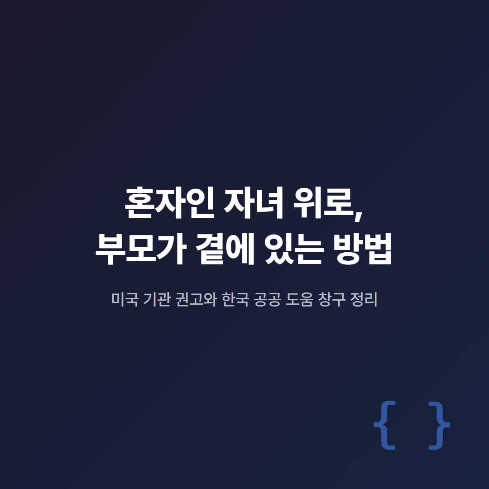
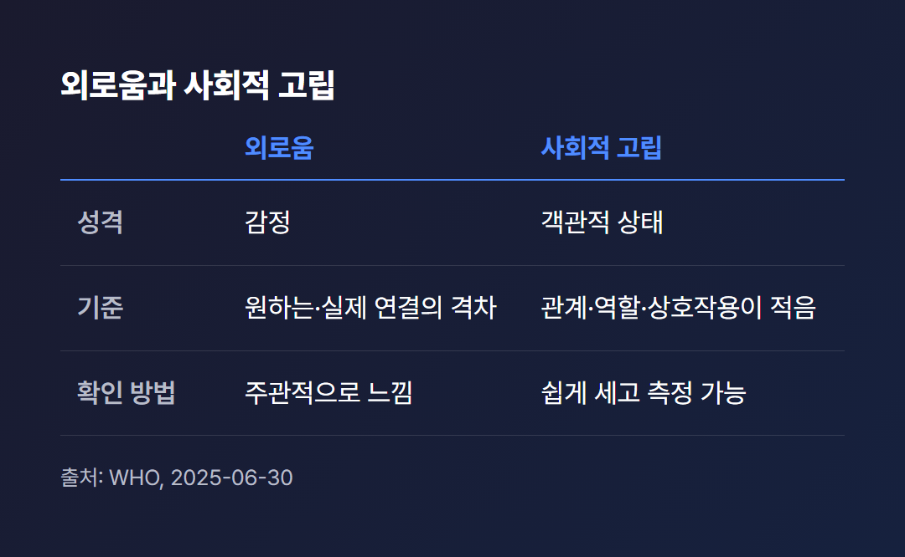
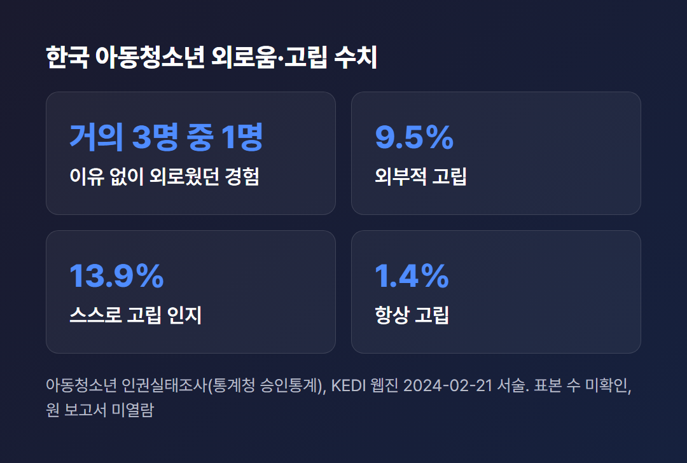
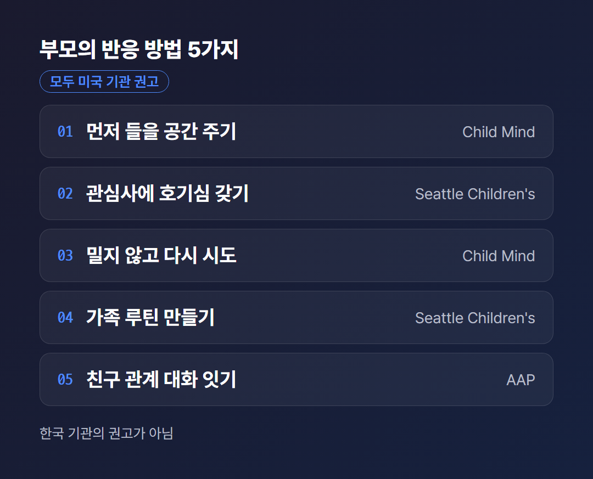
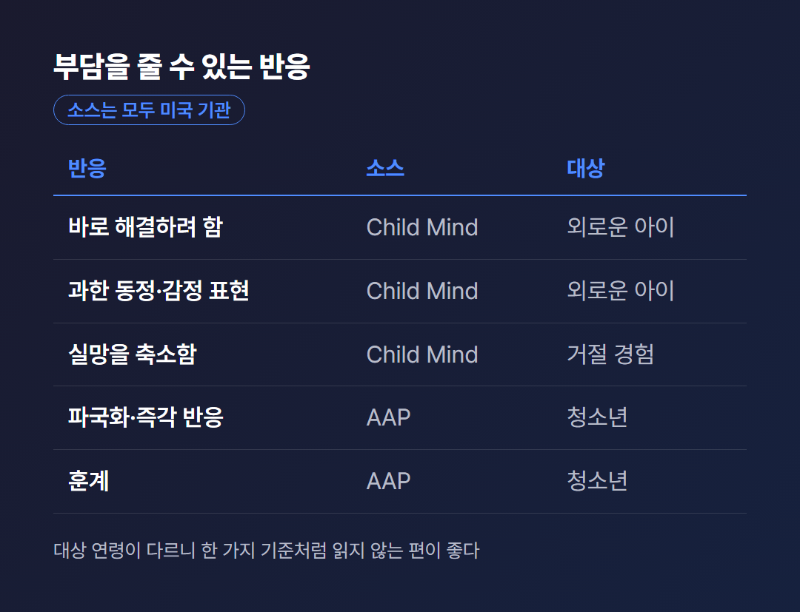
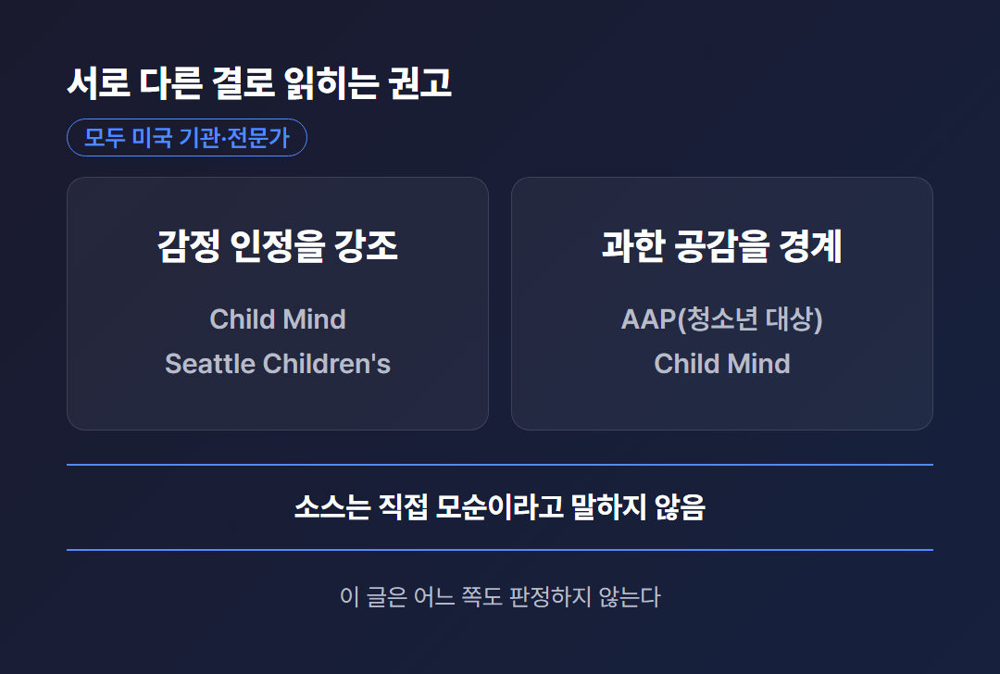
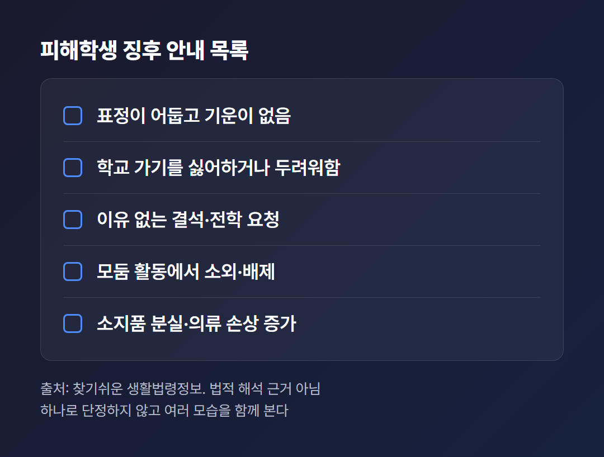
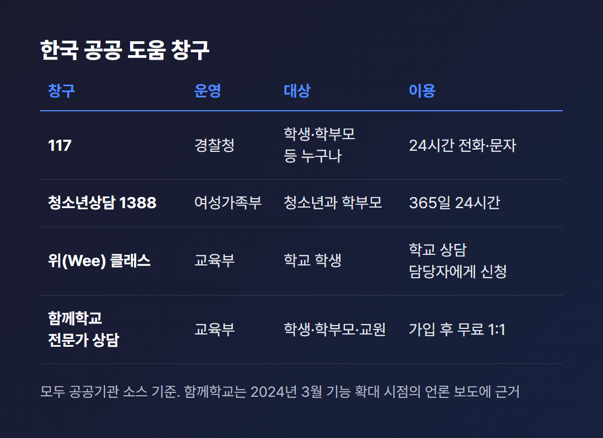

# 혼자인 자녀 위로, 부모가 곁에 있는 방법

> 2026년 5월을 기준일로 쓴 글이다. 일부 소스는 그 이후(2026년 7월, 9월)에 발행·갱신되어 날짜를 따로 적었다. 부모의 대화법은 한국 기관이 아니라 미국 기관·전문가의 권고를 전한다. 진단이나 치료를 말하는 글이 아니다.

“학교에서 우리 아이가 늘 혼자라는데, 부모인 나는 무엇을 해줘야 할까요?”

학교에서 혼자인 자녀를 둔 부모라면 한 번쯤 품어 봄 직한 질문이다. 나는 이 질문에 정답을 갖고 있지 않다. 이 글이 의지하는 것은 확인된 소스와 그 범위뿐이다.

소스가 말하는 것은 말하고, 말하지 않는 것은 말하지 않겠다. 어디까지가 확인된 내용인지도 같이 적겠다.

대표 이미지에 적은 대로, 이 글은 부모의 대화·반응 방법(미국 기관 권고)과 한국에서 확인되는 도움 창구를 나누어 정리한다.

---

## 혼자 있는 것과 외로운 것은 같을까?

같지 않다. WHO(2025년 6월 30일)는 외로움을 원하거나 필요한 사회적 연결과 실제 연결 사이의 격차에서 오는 주관적이고 고통스러운 감정이라고 설명한다. 사회적 고립은 관계·역할·상호작용이 너무 적은 객관적 상태라고 구분한다.

그러니 혼자인 자녀의 마음을 쉬는 시간의 모습만으로 알 수는 없다. 혼자라는 것은 눈에 보이는 상태이고, 외로움은 아이 안에 있는 감정이다.

표처럼 외로움은 아이가 어떻게 느끼는지의 문제이고, 고립은 관계가 얼마나 있는지의 문제다. 혼자인 자녀가 어느 쪽에 가까운지는 아이에게 물어야 알 수 있다.

그렇다면 친구가 몇 명이어야 안심할 수 있을까? 토론토 메트로폴리탄대의 라이언 페르삼(Ryan J. Persram)은 학자의 해설(The Conversation, 2026년 9월 3일)에서 질 높은 우정이 사회·정서적 어려움의 완충이 될 수 있다고 쓴다. 친구가 많을수록 불안 증상이 적은 것은 질 높은 우정을 하나라도 가질 확률이 커지기 때문일 가능성이 있다고도 한다.

이 글은 단일 원저 연구가 아니라 종합 해설이다. 우정의 수가 전혀 무관하다는 주장도 아니다.

한국의 수치도 있다. 교육정책 웹진(KEDI, 2024년 2월 21일)은 통계청 국가승인통계인 아동청소년 인권실태조사를 인용해, 이유 없이 외로웠던 경험이 거의 3명 중 1명이라고 서술한다. 관계망과 외로움 문항은 2023년에 처음 추가되었다고 한다.

같은 웹진에 따르면 코로나19 이후 초·중학생의 외로움 경험 비율이 높아졌고, 초등학생에서 두드러졌다. 고립은 두 갈래로 나뉘어, 관계망이 부족한 외부적 고립이 9.5%, 스스로 고립되었다고 느끼는 인지 고립이 13.9%, 항상 고립되었다고 느끼는 경우가 1.4%였다.

이 수치에는 한계가 있다. 나는 웹진의 서술만 읽었고 원 보고서는 열람하지 못했다. 표본 수와 응답 방식도 확인하지 못했다.

그러니 이 수치로 개별 아이의 사정을 알 수는 없다. 외로움이 국가 통계에 따로 잡힐 만큼 다뤄지는 주제라는 정도만 확인된다.

WHO는 전 세계 기준으로 청소년·청년의 외로움 비율이 약 21%로 연령대 중 가장 높고, 연령이 오르면 대체로 낮아진다고 한다. 한국 고등학생만의 수치는 확인하지 못했다.

---

## 혼자인 자녀가 말하지 않을 때 부모는 무엇을 할까?

소스가 먼저 권하는 것은 해결이 아니라 들을 공간이다. 미국 Child Mind Institute(2026년 7월 2일 갱신)는 아이가 그냥 이야기하도록 먼저 공간을 주라고 한다. 문제 해결에 들어가기 전에 들어야 실제 문제를 알 수 있다는 것이다.

한국 공공기관이 제시한 부모의 구체적 대화 지침은 확인하지 못했다. 아래는 미국 기관·전문가의 권고이고, 한국 기관의 권고가 아니다.

카드의 내용을 소스별로 풀어 쓰면 다음과 같다.

- Child Mind: 열린 질문을 하고, 행동의 변화는 질문 대신 관찰로 말한다. 아이의 말을 반영하는 예시로 “It sounds like you're having a hard time”, 지지하는 말의 예시로 “That sounds tough. Would you tell me more about that?”를 든다. 두 문장은 소스의 예시다.
- Child Mind: 아이가 말하기를 꺼리면 밀어붙이지 말고 하루나 이틀 뒤에 다시 시도한다.
- Seattle Children's(2025년 11월 24일): 아이가 좋아하는 것에 호기심을 갖고 질문하고, 들은 뒤 인정하는 말로 반응한다. 소스의 예시는 “I can see why you like that. Thanks for showing me.”이며, 편안한 시간에 가볍게 하라고 한다.
- Seattle Children's: 식사, 게임의 밤, 취침 전 루틴 같은 가족 루틴이 안정감과 소속감을 준다고 한다.
- AAP(미국소아과학회, 2022년 4월 7일): 아이가 친구 관계를 스스로 해결해야 한다고 여기지 않도록 대화를 이어가라고 한다. 아이마다 성격과 사회적 어려움이 달라 맞춤 코칭이 필요하다고 한다. 혼자인 자녀에게도 같은 말이 적용될 것이다.

AAP는 학령기 아이에게는 친구를 집에 초대하고, 학교·활동 행사에 참석해 또래 관계를 지켜보고, 갈등 상황에서 감정에 이름을 붙이도록 돕는 방법도 권한다. 이 자료는 2022년 발행이라 기준일보다 오래되었다.

Child Mind는 아이의 상황에 따라 접근이 다르다고도 쓴다. 환경이 아이에게 맞지 않는 경우에는 아이의 관심사에 맞는 활동이나 모임을 찾아보라고 한다.

[TODO: 직접 경험 넣기 - 아이가 말을 꺼내지 않던 때 곁에서 어떻게 했는지, 또는 내가 학창 시절 혼자였던 때 어떤 말이 위로가 되었는지·되지 않았는지]

---

## 혼자인 자녀를 위로하다 부담을 주는 반응은?

소스들이 겹치게 꼽는 것은 곧바로 해결 모드로 넘어가는 반응과 아이의 감정을 줄여 말하는 반응이다. 위로하려면 아이 마음을 알아야 한다. 그러려면 들어야 하고, 듣는 일에는 시간이 걸린다.

Child Mind(2026년 7월 2일)는 곧바로 문제 해결로 넘어가는 것, 과한 동정이나 감정 표현으로 반응하는 것을 피하라고 한다. 같은 기관의 거절 경험 글(2026년 1월 13일 검토)은 선의라도 실망을 축소하지 말라고 한다. 이 글은 거절이라는 일반 맥락이다.

AAP의 청소년 대상 글(2024년 8월 7일)은 판단과 즉각적인 반응, 이른바 “parent alarm”을 경계한다. 사안을 실제보다 크게 만드는 파국화는 아이를 더 불안하게 해 아이가 돌아오지 않게 된다고 설명한다. 훈계도 청소년이 잘 받아들이지 못한다고 한다.

표의 소스는 모두 미국 기관이다. 대상 연령이 다르니 한 가지 기준처럼 읽지 않는 편이 좋다.

그런데 권고가 서로 다른 결로 읽히는 지점이 있다. 한쪽은 타당화, 즉 아이의 감정을 인정하는 일을 강조한다. Child Mind는 아이가 이해받는다고 느끼는 것을 중시하고, Seattle Children's도 관심 있는 질문과 인정하는 말을 권한다.

다른 쪽은 과한 공감을 경계한다. AAP는 청소년과의 대화에서 과하게 공감하지 말고 들어주는 상대, 곧 “sounding board”가 되라고 한다. Child Mind도 과한 동정이 감정을 악화시킬 수 있다고 쓴다.

소스가 두 입장을 직접 모순이라고 말하지는 않는다. 대상 연령이나 정도의 차이일 수 있으나 그것은 소스에 없는 해석이므로, 나는 어느 쪽도 판정하지 않는다.

말을 시작하는 방식에서도 결이 다르다. Child Mind는 부모가 자신의 외로웠던 경험을 먼저 나누어 아이가 감정을 꺼낼 문을 열라고 한다. 같은 글은 아이의 이야기에 먼저 공간을 주라고도 하고, AAP는 부모의 말보다 듣기가 중요하다고 한다. 우선순위는 이 글에서 정하지 않는다.

그렇다면 부모는 무엇을 고르면 될까? 정답은 소스에 없다. 아이의 반응을 보며 그대가 조정하는 수밖에 없다.

---

## 따돌림이 의심되면 어디에 알릴까?

혼자인 것과 따돌림은 다른 개념이다. 따돌림은 법적으로 학교폭력의 한 유형이다. 찾기쉬운 생활법령정보는 2명 이상의 학생이 특정인을 지속적이거나 반복적으로 신체적·심리적으로 공격해 고통을 느끼게 하는 행위라고 정의한다. 의심이 들면 아래의 공공 창구가 확인된다.

아이의 혼자임이 따돌림 때문인지 가려내는 방법은 소스가 직접 제시하지 않는다. 생활법령정보의 피해학생 징후 안내는 법적 해석의 근거가 아니라는 단서가 붙어 있다.

가정에서 보일 수 있는 징후로는 표정이 어둡고 기운이 없음, 학교 가기를 싫어하거나 두려워함, 이유 없는 결석이나 전학 요청, 신체의 상처나 멍이 자주 보임이 있다. 학교에서는 모둠 활동에서 소외·배제됨, 쉬는 시간과 점심시간에 혼자만의 공간을 찾음, 소지품 분실과 의류 손상이 늘어남이 꼽힌다.

사이버 공간에서는 불안한 기색으로 기기를 자주 확인하거나 단체 채팅에서 반복적으로 공격받는 모습이 있다.

이 목록에는 단순히 혼자 있는 아이와 겹쳐 보일 수 있는 항목도 있다. 쉬는 시간에 혼자만의 공간을 찾는 것이 그렇다. 소스는 이 겹침을 따로 설명하지 않는다. 그러니 하나의 징후로 단정하지 않고 여러 모습을 함께 본다는 것이 이 글의 한계 안에서 말할 수 있는 전부다.

도움 창구는 다음과 같다. 모두 공공기관 소스에서 확인된 내용이다.

- 117 학교폭력 신고: 경찰청 청소년보호과가 운영한다(정부24 안내). 피해를 입었거나 상담을 원하는 학생·학부모 등 누구나, 24시간 이용한다. 같은 안내가 전화를 117 또는 182(국번 없음)로 함께 적는다. 두 표기의 관계는 확인하지 못했다. 문자는 #0117, 온라인은 안전Dream(www.safe182.go.kr)이다.
- 청소년상담 1388: 여성가족부가 운영하며(정책브리핑 2025년 3월 17일), 9~24세 청소년과 학부모·보호자가 이용할 수 있다. 친구, 가족, 학교폭력 등을 상담하고 365일 24시간 운영한다. 생명 안전이 위협받는 경우를 제외하고 상담 내용은 비밀이 보장된다. 전화는 지역번호+1388, 문자는 1388, 카카오톡은 '청소년상담1388'이다.
- 위(Wee) 클래스: 교육부 사업으로 학교의 전문상담교사나 전문상담사 등에게 신청한다. 따돌림과 대인관계 미숙 같은 문제를 다루며, 위기 학생뿐 아니라 일반 학생도 신청할 수 있고 별도 서류는 필요 없다.
- 함께학교 전문가 상담: 가입한 학생·학부모·교원이 마음건강 등 분야별 전문가에게 무료·비공개로 1:1 상담을 받는다. 담임교사에게 묻기 어려운 것을 질문하는 '답·답해·요' 코너도 있다. 이 내용은 2024년 3월 기능 확대 시점의 언론 보도에 근거한다.

학교와 어떻게 소통할지는 한국 공공기관의 상세한 안내를 확인하지 못했다. 학교폭력 맥락에서 피해학생 부모가 담임교사를 만나 해결방안을 상의하도록 안내된다는 서술을 검색 결과에서 보았을 뿐이고, 해당 페이지 본문에서 직접 읽은 것은 징후 목록까지다.

전문가의 도움이 필요한 신호도 미국 소스 위주로만 확인된다. Seattle Children's는 아이가 매우 슬프거나 위축된 모습이 2주 이상 이어지면 아이의 의사에게 연락하라고 안내한다. Child Mind는 지속적인 위축과 방에서 나오기를 꺼리는 모습 등을 들고 아동 정신건강 임상가와의 상담이 중요하다고 쓴다.

한국 공공기관의 기간 기준은 확인하지 못했다. 이 글은 진단이나 치료를 안내하지 않는다. 출발점으로 안내된 창구는 위 클래스, 1388, 함께학교다.

---

## 부모의 공감은 학교생활과 어떤 관련이 있을까?

일부 한국 연구가 관련을 보여주지만, 부모가 이렇게 하면 외로움이 줄어든다는 인과 근거로 쓸 수는 없다. 두 연구 모두 설문에 기반한 상관·매개 분석이다. 외로움을 직접 다룬 한국 논문은 목록만 확인했고 본문을 열람하지 못했다.

서울 소재 두 학교의 중학생 707명을 설문한 연구(2021년 10월)에서는 부모의 공감적 정서 반응이 인지적 유연성 통제를 거쳐 학교생활적응과 유의하게 연결되었다. 과도한 정서 반응은 주로 인지적 유연성 통제를 통해 영향을 주었고, 자기개념 명확성과 함께 작용하는 경로도 나타났다.

다문화청소년패널 1,812명을 종단 분석한 연구(노성향, 2025년)에서는 부모지지가 자아존중감을 거쳐 학교생활만족도에 영향을 주었다. 대상이 다문화청소년이라 일반화에는 한계가 있다.

그러면 부모 자신의 마음은 어떨까? 부모의 죄책감을 다룬 신뢰할 만한 소스는 찾지 못했다. 이 글의 어떤 권고도 부모를 탓하려는 것이 아니다.

Child Mind(2025년 8월 27일)는 자녀의 불안을 키우지 않으려면 부모가 자기 불안을 다루는 법을 제시한다. 복식호흡과 점진적 근육 이완, 불안을 키우는 상황 파악, 차분할 때 자신의 감정 반응을 아이에게 설명하기, 필요하면 잠시 물러나기, 치료사·배우자·친구·지지 모임과 연결하기다. 다만 이 글은 자녀의 불안 맥락이고, 친구 없는 자녀에 대한 글이 아니다.

---

학교에서 혼자인 자녀 곁에서 부모가 할 수 있는 일은, 확인된 범위에서는 말을 잘하는 기술이 아니라 들을 시간을 내는 쪽에 가까워 보인다. 그렇다고 그것이 아이의 학교생활을 바꾼다고 말할 근거는 이 글에 없다.

이 글의 권고 대부분은 미국 소스이고, 어느 집에나 맞지는 않을 것이다. 아이를 가장 잘 아는 사람은 그대다. 다른 길을 찾아도 좋다.

오늘 저녁, 혼자인 자녀가 하고 싶은 말이 있다면 그대는 어떤 표정으로 그 이야기를 들을 수 있을까? 답은 소스가 아니라 그대의 집에 있을 것이다.

[TODO: 직접 경험 넣기 - 마무리에 쓸 수 있는 내 경험(아이와 마주 앉아 이야기를 들었던 순간 등). 없으면 이 줄을 지운다]

---

## 참고 자료

- [Social connection (Q&A)](https://www.who.int/news-room/questions-and-answers/item/social-connection) — WHO, 2025-06-30
- [아동청소년 사회적 고립 현황 및 정책 방향](https://edpolicy.kedi.re.kr/edpolicy/webzine/42/841674) — 교육정책네트워크 정보센터(KEDI), 2024-02-21
- [How to Help Kids Who Are Lonely](https://childmind.org/article/how-to-help-kids-who-are-lonely/) — Child Mind Institute, 2026-07-02 갱신
- [How to Help Kids Deal With Rejection](https://childmind.org/article/how-to-help-kids-deal-with-rejection/) — Child Mind Institute, 2026-01-13 검토
- [How to Avoid Passing Anxiety to Children: Parenting Tips](https://childmind.org/article/how-to-avoid-passing-anxiety-on-to-your-kids/) — Child Mind Institute, 2025-08-27
- [3 Ways to Help Your Child or Teen Feel Less Lonely](https://www.seattlechildrens.org/healthy-tides/help-child-feel-less-lonely/) — Seattle Children's, 2025-11-24
- [How to Communicate With and Listen to Your Teen: 3 Key Tips](https://www.healthychildren.org/English/family-life/family-dynamics/communication-discipline/Pages/How-to-Communicate-with-a-Teenager.aspx) — HealthyChildren.org(AAP), 2024-08-07
- [What Parents Can Do to Support Friendships](https://www.healthychildren.org/English/family-life/power-of-play/Pages/what-parents-can-do-to-support-friendships.aspx) — HealthyChildren.org(AAP), 2022-04-07
- [How high-quality friendship supports teen well-being](https://theconversation.com/how-high-quality-friendship-supports-teen-well-being-289265) — Ryan J. Persram, The Conversation, 2026-09-03
- [무엇이든 물어보세요 '청소년상담 1388'](https://www.korea.kr/news/policyNewsView.do?newsId=148940556) — 대한민국 정책브리핑(여성가족부), 2025-03-17
- [학교폭력 신고 서비스(117)](https://www.gov.kr/portal/service/serviceInfo/PTR000050497) — 정부24(경찰청 청소년보호과)
- [학교폭력의 개념](https://www.easylaw.go.kr/CSP/CnpClsMain.laf?csmSeq=1408&ccfNo=1&cciNo=1&cnpClsNo=1) — 찾기쉬운 생활법령정보(법제처)
- [학교폭력의 징후](https://easylaw.go.kr/CSP/CnpClsMain.laf?popMenu=ov&csmSeq=1408&ccfNo=1&cciNo=1&cnpClsNo=3) — 찾기쉬운 생활법령정보(법제처)
- [위(Wee) 클래스 상담 지원](https://www.gov.kr/portal/service/serviceInfo/134200005007) — 정부24(교육부 학생정서지원과)
- ['함께학교' 플랫폼에서 법률·마음건강 등 무료 상담 받아보세요](https://www.etoday.co.kr/news/view/2338872) — 이투데이, 2024-03 기능 확대 시점 기사
- [부모공감이 청소년의 학교생활적응에 미치는 영향](https://scholar.kyobobook.co.kr/article/detail/4010028572614) — 학습자중심교과교육연구 21권 20호, 2021-10
- [다문화가정 청소년의 부모지지, 자아존중감 학교생활만족도의 종단적 관계](https://www.kci.go.kr/kciportal/ci/sereArticleSearch/ciSereArtiView.kci?sereArticleSearchBean.artiId=ART003237541) — 노성향, 사회과학연구, 2025

---

#혼자인자녀 #학교생활 #부모위로 #자녀대화법 #외로움 #따돌림 #청소년상담1388 #Wee클래스 #부모마음

<!-- 발행 메모 (블로그에 올릴 때는 이 아래를 지운다)
제목: 혼자인 자녀 위로, 부모가 곁에 있는 방법 (23자)
핵심 키워드: 혼자인 자녀 / 본문 글자 수(공백 제외, 표·목록 포함, IMAGE·TODO·참고자료·태그 제외): 4,812자 / 키워드 '혼자인 자녀' 횟수: 본문 8회, 제목 포함 9회 (글자 기준 약 0.94%, 단어 기준 약 0.19%)
이미지 자리: 8개
직접 채울 곳([TODO]): 2곳(2장 끝, 마무리 끝)
research.md에 없어서 뺀 내용: 한국 기관의 부모 대화법, 부모 죄책감, 고등학생 수치, 학교와 소통하는 구체 방법, 한국 기준의 전문가 도움 기간 기준, 미국 위기 번호
research.md의 정보 충돌을 어떻게 다뤘는지: 타당화 대 과한 공감, 경험 먼저 나누기 대 공간 먼저, 117 또는 182 표기를 모두 전하고 판정하지 않음
발행 전 확인: 키워드 밀도 1.5% 미달(자연스러운 선에서 반복 억제). 수치·소스 날짜는 research와 대조 완료. 이미지 설명 속 표·카드 셀 길이는 image-maker 단계에서 확인
-->

<!-- 조립 점검 (assembler)
점검일: 2026-10-01
이미지: 총 8개 / 파일 확인 8개 / 없는 파일 0개
남은 [IMAGE:] 마커: 0개
[TODO]: 2개
본문 글자 수(공백 제외, 제목~태그, 이미지 문법 제외): 7425자 (참고 자료·태그·TODO 제외 4953자)
알트 텍스트 누락: 0개
-->
